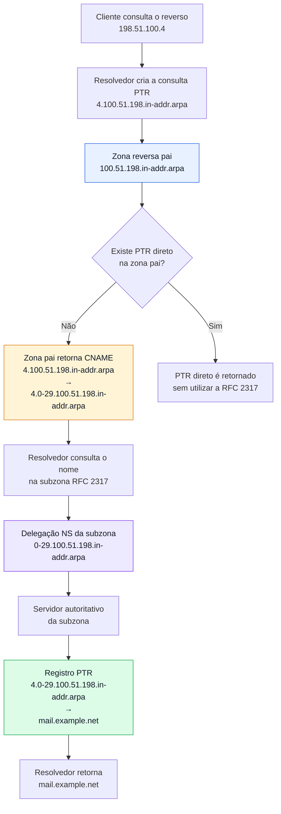

# Delegação de DNS Reverso para Sub-redes menores que /24 com RFC 2317

## Objetivo

Este documento descreve como delegar o DNS reverso de sub-redes IPv4 menores que `/24`, conforme o mecanismo definido na RFC 2317.

A técnica permite que blocos como `/25`, `/26`, `/27`, `/28`, `/29` e `/30` tenham seus registros PTR administrados separadamente da zona reversa principal.

Os exemplos utilizam:

* PowerDNS Authoritative Server;
* PostgreSQL como backend;
* comandos SQL executados diretamente nas tabelas `domains` e `records`.

O princípio de funcionamento, entretanto, não depende do PowerDNS. A mesma técnica pode ser implementada em outros servidores DNS autoritativos, como o BIND9, adaptando apenas a forma de cadastro das zonas e dos registros.

## Contexto

A delegação tradicional de zonas reversas IPv4 ocorre nos limites dos octetos.

Para uma rede `/24`, por exemplo, a zona reversa pode ser delegada diretamente:

```text
100.51.198.in-addr.arpa
```

Para sub-redes menores que `/24`, como `198.51.100.0/29`, não existe uma correspondência direta entre o prefixo CIDR e um nível da árvore DNS.

A RFC 2317 resolve essa limitação por meio de:

1. uma subzona reversa com nome convencionado;
2. registros CNAME na zona reversa pai;
3. registros PTR armazenados na nova subzona;
4. registros NS que identificam os servidores autoritativos da subzona.

## Compatibilidade

Este procedimento pode ser aplicado em servidores DNS autoritativos compatíveis com os registros utilizados pela RFC 2317, incluindo:

* PowerDNS;
* BIND9;
* Knot DNS;
* NSD.

Nos exemplos deste documento, os registros são inseridos diretamente no banco PostgreSQL utilizado pelo PowerDNS.

Em ambientes gerenciados, considere utilizar a API do PowerDNS ou a ferramenta oficial de administração, evitando alterações diretas no banco sem validação prévia.

## Ambiente de exemplo

Será utilizada a seguinte sub-rede reservada para documentação:

```text
198.51.100.0/29
```

Servidores DNS autoritativos:

```text
ns1.example.net
ns2.example.net
ns3.example.net
```

Servidor DNS utilizado nos testes diretos:

```text
192.0.2.53
```

Zona reversa pai:

```text
100.51.198.in-addr.arpa
```

Subzona RFC 2317 adotada no exemplo:

```text
0-29.100.51.198.in-addr.arpa
```

!!! note

```
A RFC 2317 não exige um único padrão de nome para a subzona delegada.

Nomes como `0-7`, `0-29` ou outras convenções podem ser utilizados, desde que a zona pai, a subzona, os CNAMEs e os registros NS permaneçam consistentes.
```

## Como funciona a delegação RFC 2317

Considere a consulta reversa para o endereço:

```text
198.51.100.4
```

A consulta DNS inicial será feita para:

```text
4.100.51.198.in-addr.arpa
```

Na zona pai, esse nome não terá um registro PTR direto. Em seu lugar, será criado um CNAME:

```text
4.100.51.198.in-addr.arpa
    CNAME
4.0-29.100.51.198.in-addr.arpa
```

O registro PTR definitivo ficará armazenado na subzona:

```text
4.0-29.100.51.198.in-addr.arpa
    PTR
mail.example.net
```

### Fluxo da delegação



O fluxo principal é:

1. o resolvedor consulta o PTR na zona reversa pai;
2. a zona pai retorna um CNAME;
3. o CNAME aponta para um nome pertencente à subzona RFC 2317;
4. a delegação NS direciona a consulta aos servidores autoritativos da subzona;
5. a subzona retorna o registro PTR definitivo.

!!! warning

```
Não mantenha simultaneamente um PTR direto e um CNAME para o mesmo nome na zona pai.

Um nome que possui CNAME não deve possuir outros tipos de registro, exceto os registros permitidos pelas especificações do DNS.
```

## Pré-requisitos

Antes de iniciar, verifique:

* acesso administrativo ao PowerDNS;
* acesso ao PostgreSQL;
* existência da zona reversa pai;
* autoridade sobre a zona reversa pai;
* definição dos servidores autoritativos da nova subzona;
* identificação dos endereços utilizáveis da sub-rede;
* definição dos nomes PTR que serão cadastrados;
* cópia de segurança das zonas e dos registros afetados.

!!! warning

```
Alterações diretas no banco do PowerDNS podem afetar imediatamente o serviço DNS.

Execute os comandos inicialmente em ambiente de homologação ou dentro de uma transação PostgreSQL.
```

Exemplo:

```sql
BEGIN;

-- Alterações e verificações

ROLLBACK;
```

Depois de validar os comandos, execute novamente utilizando `COMMIT`.

## Etapa 1 — Criar a subzona reversa

Cadastrar a nova zona no PowerDNS:

```sql
INSERT INTO domains (name, type)
VALUES (
    '0-29.100.51.198.in-addr.arpa',
    'NATIVE'
);
```

Obter o ID atribuído à zona:

```sql
SELECT id
FROM domains
WHERE name = '0-29.100.51.198.in-addr.arpa';
```

Exemplo de resultado:

```text
  id
-------
 90001
```

O valor retornado será utilizado como `domain_id` nos registros pertencentes à subzona.

!!! note

```
O identificador `90001` é apenas um exemplo.

Utilize sempre o ID retornado pelo banco de dados do ambiente em que a zona foi criada.
```

## Etapa 2 — Cadastrar o SOA e os registros NS

### Registro SOA

```sql
INSERT INTO records (
    domain_id,
    name,
    type,
    content,
    ttl,
    prio,
    disabled,
    auth
)
VALUES (
    90001,
    '0-29.100.51.198.in-addr.arpa',
    'SOA',
    'ns1.example.net. dns-admin.example.net. 2026010101 10800 3600 604800 14400',
    14400,
    0,
    FALSE,
    TRUE
);
```

O campo `content` contém:

```text
MNAME RNAME SERIAL REFRESH RETRY EXPIRE MINIMUM
```

No exemplo:

| Campo   |                    Valor |
| ------- | -----------------------: |
| MNAME   |       `ns1.example.net.` |
| RNAME   | `dns-admin.example.net.` |
| SERIAL  |             `2026010101` |
| REFRESH |                  `10800` |
| RETRY   |                   `3600` |
| EXPIRE  |                 `604800` |
| MINIMUM |                  `14400` |

No campo `RNAME`, o primeiro ponto representa o caractere `@` do endereço de e-mail.

Assim:

```text
dns-admin.example.net.
```

representa:

```text
dns-admin@example.net
```

### Registros NS

```sql
INSERT INTO records (
    domain_id,
    name,
    type,
    content,
    ttl,
    prio,
    disabled,
    auth
)
VALUES
    (
        90001,
        '0-29.100.51.198.in-addr.arpa',
        'NS',
        'ns1.example.net',
        14400,
        0,
        FALSE,
        TRUE
    ),
    (
        90001,
        '0-29.100.51.198.in-addr.arpa',
        'NS',
        'ns2.example.net',
        14400,
        0,
        FALSE,
        TRUE
    ),
    (
        90001,
        '0-29.100.51.198.in-addr.arpa',
        'NS',
        'ns3.example.net',
        14400,
        0,
        FALSE,
        TRUE
    );
```

## Etapa 3 — Cadastrar os registros PTR

Neste exemplo, serão utilizados os seguintes mapeamentos:

| Endereço IPv4  | Registro PTR          |
| -------------- | --------------------- |
| `198.51.100.3` | `gateway.example.net` |
| `198.51.100.4` | `mail.example.net`    |

Cadastrar os registros:

```sql
INSERT INTO records (
    domain_id,
    name,
    type,
    content,
    ttl,
    prio,
    disabled,
    auth
)
VALUES
    (
        90001,
        '3.0-29.100.51.198.in-addr.arpa',
        'PTR',
        'gateway.example.net',
        14400,
        0,
        FALSE,
        TRUE
    ),
    (
        90001,
        '4.0-29.100.51.198.in-addr.arpa',
        'PTR',
        'mail.example.net',
        14400,
        0,
        FALSE,
        TRUE
    );
```

!!! warning

```
Um endereço IP pode tecnicamente possuir mais de um registro PTR, mas diversos serviços esperam apenas um nome reverso por endereço.

Para servidores de e-mail, é recomendável manter um único PTR e garantir que o nome retornado também resolva para o endereço original.
```

Exemplo de consistência direta e reversa:

```text
198.51.100.4
    PTR mail.example.net

mail.example.net
    A 198.51.100.4
```

## Etapa 4 — Identificar a zona reversa pai

Localizar o domínio correspondente ao bloco `/24`:

```sql
SELECT id
FROM domains
WHERE name = '100.51.198.in-addr.arpa';
```

Exemplo de resultado:

```text
  id
-------
 12000
```

O identificador da zona pai será utilizado nos registros CNAME e NS criados nas etapas seguintes.

Caso a zona pai ainda não exista, ela deverá ser criada e configurada com seus registros SOA e NS antes da delegação RFC 2317.

## Etapa 5 — Remover registros conflitantes da zona pai

Antes de criar os CNAMEs, verifique se existem registros PTR para os endereços da sub-rede:

```sql
SELECT id, name, type, content
FROM records
WHERE domain_id = 12000
  AND name IN (
      '1.100.51.198.in-addr.arpa',
      '2.100.51.198.in-addr.arpa',
      '3.100.51.198.in-addr.arpa',
      '4.100.51.198.in-addr.arpa',
      '5.100.51.198.in-addr.arpa',
      '6.100.51.198.in-addr.arpa'
  );
```

Se os PTR antigos tiverem sido confirmados como substituíveis, remova-os:

```sql
DELETE FROM records
WHERE domain_id = 12000
  AND name IN (
      '1.100.51.198.in-addr.arpa',
      '2.100.51.198.in-addr.arpa',
      '3.100.51.198.in-addr.arpa',
      '4.100.51.198.in-addr.arpa',
      '5.100.51.198.in-addr.arpa',
      '6.100.51.198.in-addr.arpa'
  );
```

!!! warning

```
Confirme os registros retornados pelo `SELECT` antes de executar o `DELETE`.

A remoção incorreta pode interromper a resolução reversa de outros endereços.
```

## Etapa 6 — Criar os CNAMEs na zona pai

Cada nome reverso da zona pai deve apontar para o nome correspondente na subzona RFC 2317.

```sql
INSERT INTO records (
    domain_id,
    name,
    type,
    content,
    ttl,
    prio,
    disabled,
    auth
)
VALUES
    (
        12000,
        '1.100.51.198.in-addr.arpa',
        'CNAME',
        '1.0-29.100.51.198.in-addr.arpa',
        14400,
        0,
        FALSE,
        TRUE
    ),
    (
        12000,
        '2.100.51.198.in-addr.arpa',
        'CNAME',
        '2.0-29.100.51.198.in-addr.arpa',
        14400,
        0,
        FALSE,
        TRUE
    ),
    (
        12000,
        '3.100.51.198.in-addr.arpa',
        'CNAME',
        '3.0-29.100.51.198.in-addr.arpa',
        14400,
        0,
        FALSE,
        TRUE
    ),
    (
        12000,
        '4.100.51.198.in-addr.arpa',
        'CNAME',
        '4.0-29.100.51.198.in-addr.arpa',
        14400,
        0,
        FALSE,
        TRUE
    ),
    (
        12000,
        '5.100.51.198.in-addr.arpa',
        'CNAME',
        '5.0-29.100.51.198.in-addr.arpa',
        14400,
        0,
        FALSE,
        TRUE
    ),
    (
        12000,
        '6.100.51.198.in-addr.arpa',
        'CNAME',
        '6.0-29.100.51.198.in-addr.arpa',
        14400,
        0,
        FALSE,
        TRUE
    );
```

Em uma rede `/29`:

* o primeiro endereço representa a rede;
* o último endereço representa o broadcast;
* os endereços intermediários normalmente são utilizáveis.

Neste exemplo, os CNAMEs foram criados para os endereços de `1` a `6`.

## Etapa 7 — Delegar a subzona na zona pai

Cadastrar os registros NS da subzona dentro da zona pai:

```sql
INSERT INTO records (
    domain_id,
    name,
    type,
    content,
    ttl,
    prio,
    disabled,
    auth
)
VALUES
    (
        12000,
        '0-29.100.51.198.in-addr.arpa',
        'NS',
        'ns1.example.net',
        14400,
        0,
        FALSE,
        TRUE
    ),
    (
        12000,
        '0-29.100.51.198.in-addr.arpa',
        'NS',
        'ns2.example.net',
        14400,
        0,
        FALSE,
        TRUE
    ),
    (
        12000,
        '0-29.100.51.198.in-addr.arpa',
        'NS',
        'ns3.example.net',
        14400,
        0,
        FALSE,
        TRUE
    );
```

Esses registros informam quais servidores possuem autoridade sobre:

```text
0-29.100.51.198.in-addr.arpa
```

## Validação

### Verificar a nova zona no banco

```sql
SELECT
    d.name AS zone,
    r.name,
    r.type,
    r.content,
    r.ttl,
    r.auth
FROM domains AS d
JOIN records AS r
    ON r.domain_id = d.id
WHERE d.name = '0-29.100.51.198.in-addr.arpa'
ORDER BY r.type, r.name, r.content;
```

### Verificar os CNAMEs na zona pai

```sql
SELECT name, type, content
FROM records
WHERE domain_id = 12000
  AND type = 'CNAME'
  AND name LIKE '%.100.51.198.in-addr.arpa'
ORDER BY name;
```

### Testar o PTR diretamente no servidor autoritativo

```bash
dig -x 198.51.100.4 @192.0.2.53
```

Trecho esperado:

```text
4.100.51.198.in-addr.arpa.       14400 IN CNAME 4.0-29.100.51.198.in-addr.arpa.
4.0-29.100.51.198.in-addr.arpa.  14400 IN PTR   mail.example.net.
```

O resultado deve mostrar:

1. o CNAME criado na zona pai;
2. o PTR existente na subzona;
3. o nome final associado ao endereço.

### Testar o SOA da subzona

```bash
dig -t SOA \
  0-29.100.51.198.in-addr.arpa \
  +noall +answer \
  @192.0.2.53
```

Resultado esperado:

```text
0-29.100.51.198.in-addr.arpa. 14400 IN SOA ns1.example.net. dns-admin.example.net. 2026010101 10800 3600 604800 14400
```

### Testar os registros NS

```bash
dig -t NS \
  0-29.100.51.198.in-addr.arpa \
  +noall +answer \
  @192.0.2.53
```

Resultado esperado:

```text
0-29.100.51.198.in-addr.arpa. 14400 IN NS ns1.example.net.
0-29.100.51.198.in-addr.arpa. 14400 IN NS ns2.example.net.
0-29.100.51.198.in-addr.arpa. 14400 IN NS ns3.example.net.
```

### Testar a cadeia pública de delegação

```bash
dig +trace -x 198.51.100.4
```

Em um ambiente publicamente delegado, a saída deve demonstrar:

1. consulta à raiz DNS;
2. encaminhamento para `in-addr.arpa`;
3. delegação da zona reversa pai;
4. resposta CNAME da zona pai;
5. consulta à subzona RFC 2317;
6. resposta PTR final.

!!! note

```
Os blocos `192.0.2.0/24`, `198.51.100.0/24` e `203.0.113.0/24` são reservados para documentação.

Por isso, os exemplos deste documento não produzirão uma resolução pública real.
```

## Aplicação no BIND9

No BIND9, a lógica permanece a mesma.

Na zona pai, os registros seriam semelhantes a:

```dns
$ORIGIN 100.51.198.in-addr.arpa.

0-29    IN NS    ns1.example.net.
0-29    IN NS    ns2.example.net.
0-29    IN NS    ns3.example.net.

1       IN CNAME 1.0-29.100.51.198.in-addr.arpa.
2       IN CNAME 2.0-29.100.51.198.in-addr.arpa.
3       IN CNAME 3.0-29.100.51.198.in-addr.arpa.
4       IN CNAME 4.0-29.100.51.198.in-addr.arpa.
5       IN CNAME 5.0-29.100.51.198.in-addr.arpa.
6       IN CNAME 6.0-29.100.51.198.in-addr.arpa.
```

Na subzona delegada:

```dns
$ORIGIN 0-29.100.51.198.in-addr.arpa.
$TTL 14400

@   IN SOA ns1.example.net. dns-admin.example.net. (
        2026010101
        10800
        3600
        604800
        14400
    )

    IN NS ns1.example.net.
    IN NS ns2.example.net.
    IN NS ns3.example.net.

3   IN PTR gateway.example.net.
4   IN PTR mail.example.net.
```

A forma de armazenamento é diferente, mas o fluxo de resolução permanece igual ao apresentado no diagrama.

## Problemas comuns

### CNAME e PTR no mesmo nome

Um PTR antigo permanece cadastrado na zona pai enquanto um CNAME é criado para o mesmo nome.

Correção:

* localizar o PTR conflitante;
* confirmar que ele pertence à faixa delegada;
* removê-lo antes de criar o CNAME.

### CNAME apontando para a zona incorreta

Exemplo incorreto:

```text
4.100.51.198.in-addr.arpa
    CNAME
4.100.51.198.in-addr.arpa
```

Esse registro cria uma referência circular.

O destino deve pertencer à subzona RFC 2317:

```text
4.0-29.100.51.198.in-addr.arpa
```

### Ausência dos registros NS na zona pai

A subzona existe no servidor, mas não foi delegada na zona pai.

Correção:

* criar os registros NS da subzona dentro da zona pai;
* confirmar que os servidores indicados respondem autoritativamente.

### SOA inconsistente

O campo MNAME do SOA aponta para um servidor que não consta entre os NS ou que não responde pela zona.

Correção:

* revisar o SOA;
* revisar os NS;
* consultar diretamente cada servidor autoritativo.

### Serial não atualizado

Alterações em arquivos de zona do BIND9 ou em ambientes com transferência de zona podem não ser propagadas quando o serial não é incrementado.

No PowerDNS com backend PostgreSQL, o comportamento depende da arquitetura, da replicação e da forma de provisionamento adotada.

### TTL elevado durante testes

Respostas antigas podem permanecer em cache.

Durante implantação controlada, pode ser útil reduzir previamente o TTL. Depois da validação, o TTL pode ser aumentado novamente.

## Limitações

* A RFC 2317 é utilizada para delegação reversa IPv4 sem alinhamento em `/24`.
* Para IPv6, o DNS reverso utiliza a árvore `ip6.arpa` e delegações baseadas em nibbles hexadecimais.
* O procedimento depende de controle sobre a zona reversa pai.
* A simples criação da subzona não estabelece a delegação.
* Alterações diretas no banco exigem conhecimento do esquema e dos procedimentos operacionais do PowerDNS.
* O exemplo não aborda DNSSEC, transferência de zona, replicação do PostgreSQL ou automação via API.

## Conclusão

A RFC 2317 permite delegar a administração de DNS reverso para sub-redes IPv4 menores que `/24`.

O mecanismo utiliza:

* registros CNAME na zona reversa pai;
* uma subzona reversa independente;
* registros NS para delegação;
* registros PTR na subzona.

No PowerDNS com PostgreSQL, esses elementos podem ser cadastrados nas tabelas `domains` e `records`.

No BIND9, os mesmos registros são representados em arquivos de zona.

Independentemente do software utilizado, a resolução segue o mesmo fluxo: a consulta chega à zona pai, recebe um CNAME, segue para a subzona delegada e obtém o PTR definitivo.

## Referências

* [RFC 2317 — Classless IN-ADDR.ARPA Delegation](https://www.rfc-editor.org/rfc/rfc2317)
* [RFC 1034 — Domain Names: Concepts and Facilities](https://www.rfc-editor.org/rfc/rfc1034)
* [RFC 1035 — Domain Names: Implementation and Specification](https://www.rfc-editor.org/rfc/rfc1035)
* [PowerDNS Authoritative Server](https://doc.powerdns.com/authoritative/)
* [BIND 9 Administrator Reference Manual](https://bind9.readthedocs.io/)
