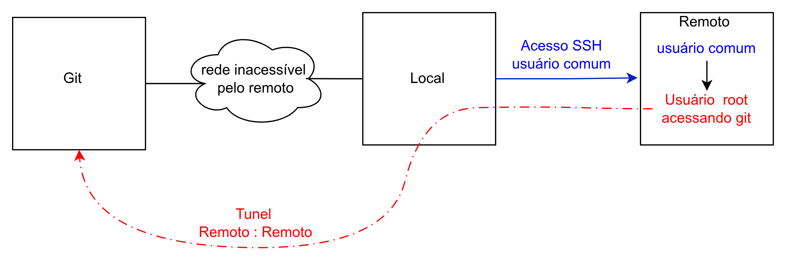
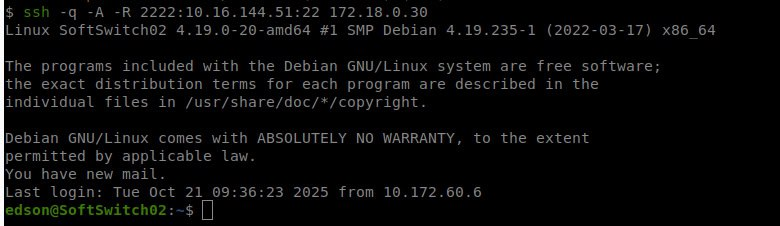
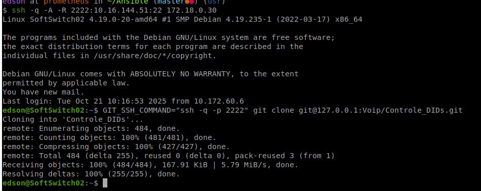
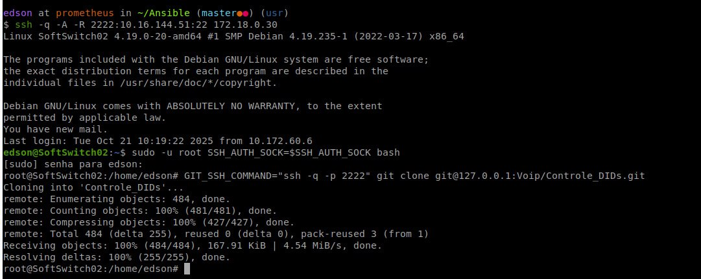

# Root acessando Git de usuário comum via túnel SSH

Em alguns ambientes, uma máquina intermediária não possui acesso direto ao servidor Git. Nesses casos, é possível utilizar um túnel SSH reverso para encaminhar a conexão até o servidor Git, permitindo operações como git clone, git pull e git push sem alterar a topologia da rede.

Quando o acesso é realizado utilizando autenticação por chave pública, também é possível reutilizar o agente SSH (ssh-agent) da máquina de origem por meio do Agent Forwarding. Dessa forma, a chave privada permanece na estação de trabalho do usuário, sem necessidade de ser copiada para o servidor remoto.

Este documento demonstra como utilizar o encaminhamento de portas (SSH Port Forwarding) em conjunto com o encaminhamento do agente SSH (SSH Agent Forwarding) para permitir que um usuário remoto — inclusive o root — acesse um repositório Git utilizando a chave armazenada na máquina de origem.



## 1\. Criar túnel SSH a partir da sua máquina local

Execute o comando abaixo para criar um túnel SSH encaminhando a porta local do Git para a máquina de destino:

`ssh -A -R 2222:git.example.net:22 usuario@bastion.example.net`

Exemplo de saída:



## 2\. Clonar ou dar pull no repositório Git como usuário normal

Já dentro da máquina remota, execute:

`GIT_SSH_COMMAND="ssh -p 2222" git clone git@127.0.0.1:infra/exemplo.git`

Exemplo de saída:



### GIT_SSH_COMMAND

O Git utiliza o cliente SSH padrão do sistema para estabelecer conexão com o servidor remoto.

Como neste procedimento o servidor Git está acessível através do túnel SSH criado na porta **2222**, é necessário instruir o Git a utilizar essa porta em vez da porta padrão (**22**).

Isso é feito através da variável de ambiente:

```
GIT_SSH_COMMAND="ssh -p 2222"
```

Assim, todas as conexões iniciadas pelo Git serão realizadas utilizando o cliente SSH configurado para acessar o túnel local.


## 3\. Executando como usuário root (se necessário)

Se precisar executar como `root`, primeiro exporte o agente SSH atual:

`sudo -u root SSH_AUTH_SOCK=$SSH_AUTH_SOCK bash`

E então clone ou faça pull normalmente:

`GIT_SSH_COMMAND="ssh -p 2222" git clone git@127.0.0.1:infra/exemplo.git`

Exemplo de saída:



### SSH_AUTH_SOCK

Durante a conexão com a opção -A, o SSH encaminha o acesso ao ssh-agent da máquina de origem para a máquina remota.

Esse acesso é disponibilizado através da variável de ambiente:

```
SSH_AUTH_SOCK
```

Ao executar comandos com sudo ou iniciar uma sessão como root, essa variável normalmente deixa de existir, fazendo com que o usuário root perca acesso ao agente SSH encaminhado.

Ao iniciar uma sessão preservando o valor de SSH_AUTH_SOCK:

```
sudo -u root SSH_AUTH_SOCK=$SSH_AUTH_SOCK bash 
```

o processo executado como root continua utilizando o mesmo agente SSH da sessão original, sem necessidade de copiar ou duplicar a chave privada.

## Referência

Este procedimento segue a documentação ["SSH - Port Forwarding"](ssh-port_forwarding.md)
