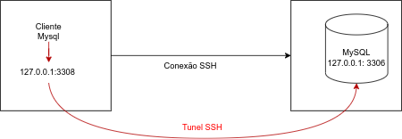
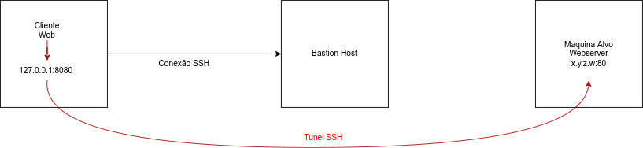
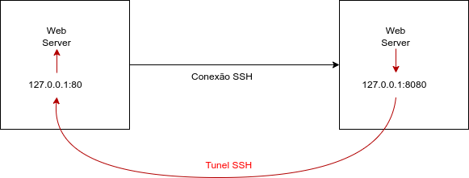
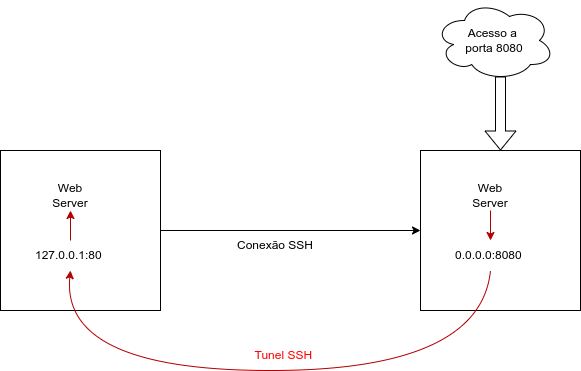

# SSH - Port Forwarding

## Introdução

O encaminhamento de porta (Port Forwarding) no SSH é uma técnica usada para redirecionar conexões de rede por meio de um túnel seguro. Este documento aborda os diferentes tipos de encaminhamento de porta via SSH.

## Port Forward Local para Remoto

O encaminhamento local para remoto permite que uma máquina local (cliente) encaminhe conexões para um servidor remoto, que então direciona essa conexão para outro destino. Isso é útil, por exemplo, para acessar serviços protegidos atrás de firewalls ou restritos a redes internas.

### Exemplo de Uso

Se você possui um serviço de banco de dados (BD) rodando em uma máquina na porta 3306, e o BD  nessa máquina não é diretamente acessível, você pode usar um túnel SSH para acessar o serviço.

Consiste em criar uma porta local e redirecionar tudo que for para esta porta para a porta remota :



### Sintaxe do Comando

```
ssh -L [porta_local]:[host_remoto]:[porta_remota] [usuario]@[servidor]
```

#### Parâmetros:

-   `-L`: Indica que é um túnel local.
-   `[porta_local]`: Porta na máquina local onde o cliente escutará.
-   `[host_remoto]`: Endereço do destino final ao qual o servidor remoto irá encaminhar a conexão.
-   `[porta_remota]`: Porta no host remoto que será acessada.
-   `[usuario]@[servidor]`: Credenciais e endereço do servidor SSH intermediário.

### Exemplo Prático

Acessando o servidor de banco de dados que está configurado para aceitar conexões apenas de localhost:

```
ssh -L 3308:127.0.0.1:3306 usuario@db.example.net
```

Neste caso:

-   A porta `3308` será aberta na máquina local.
-   Qualquer solicitação para `localhost:3308` será encaminhada via SSH para `db.example.net`, e a solicitação será encaminhada para `127.0.0.1:3306`.

### Teste de Acesso

No cliente MySQL, use o seguinte endereço `localhost:3308` :

Exemplo:

```
telnet localhost 3308
```

Isso redirecionará automaticamente para o serviço na máquina onde o BD responde apenas localmente.

## Port Forwarding local para máquina e porta remota

Muito útil quando se necessita passar por alguma restrição. Imaginemos o caso de uma maquina local sem acesso a uma rede restrita e que precisa acessar uma página em uma máquina nessa rede restrita. Você pode usar uma máquina intermediária com acesso a essa rede.

### Exemplo de Uso

Se você possui um serviço web rodando em uma máquina na porta 80, mas essa máquina não é diretamente acessível, você pode usar um túnel SSH para acessar o serviço via uma máquina intermediária (bastion host).



### Sintaxe do Comando

O mesmo que para port forward local para remoto, com a diferença do detalhe que especificaremos a maquina remota

### Exemplo Prático

Acesse um servidor web protegido em `198.51.100.10` pela porta 80 através do servidor SSH intermediário `bastion.example.net`:

```
ssh -L 8080:198.51.100.10:80 usuario@bastion.example.net
```


Neste caso:

-   A porta `8080` será aberta na máquina local.
-   Qualquer solicitação para `localhost:8080` será encaminhada via SSH para `198.51.100.10:80`.

### Teste de Acesso

Abra um navegador e acesse:

```
http://localhost:8080
```

Isso redirecionará automaticamente para o serviço na máquina protegida.

## Port Forward Remoto para Local

O encaminhamento remoto para local permite que conexões realizadas em um servidor remoto sejam redirecionadas para um cliente local. Isso é especialmente útil para acessar serviços locais de uma máquina remota que, de outra forma, não estariam acessíveis. 

### Exemplo de Uso

Imagine que você esteja em um ambiente remoto e precisa acessar um servidor web ou serviço rodando em sua máquina local (cliente SSH). Para isso, você cria um túnel para redirecionar as conexões.



### Sintaxe do Comando

```
ssh -R [porta_remota]:[host_local]:[porta_local] [usuario]@[servidor]
```

#### Parâmetros:

-   `-R`: Indica que é um túnel remoto.
-   `[porta_remota]`:Porta aberta no servidor remoto para escutar conexões
-   `[host_local]`:Endereço do destino final no cliente local.
-   `[porta_local]`:Porta no cliente local que será acessada.
-   `[usuario]@[servidor]`: Credenciais e endereço do servidor SSH intermediário.

### Exemplo Prático

Redirecionando conexões para sua máquina local através de um servidor remoto:

```
ssh -R 8080:127.0.0.1:80 usuario@servidor.example.net
```

Neste caso:

-   A porta 8080 será aberta no servidor remoto. 

-   Qualquer solicitação feita ao servidor remoto na porta 8080 será redirecionada para localhost:80 na máquina local.

### Teste de Acesso

No ambiente remoto, abra um navegador e acesse:

```
http://servidor\_remoto:8080
```

Isso redirecionará automaticamente para o serviço rodando em sua máquina local na porta 80.

## Port Forward Remoto para Local usando Máquina Local como Bastion

Este cenário combina o uso de um túnel remoto com a máquina local agindo como bastion host. Ele é útil quando você deseja disponibilizar um serviço local para acesso externo por meio de um servidor intermediário.

### Exemplo de Uso

Imagine que você tenha um servidor web local na porta 80 e deseja disponibilizá-lo para acesso remoto por meio de um servidor SSH intermediário, que responderá como um servidor web na porta 8080.



### Sintaxe do Comando

```
ssh -R [porta_remota]:[host_local]:[porta_local] [usuario]@[servidor]
```

Configuração do `/etc/ssh/sshd_config` da máquina que receberá a conexão SSH e ficará exposta ao serviço para outros:

```
GatewayPorts yes
GatewayPorts clientspecified
```

Após a alteração, reinicie o serviço SSH para aplicar as mudanças:

```
sudo systemctl restart sshd
```

### Exemplo Prático

```
ssh -R 9000:127.0.0.1:8080 usuario@servidor.example.net
```

Neste caso:

-   A porta 9000 será aberta no servidor remoto.
-   Qualquer solicitação feita ao servidor remoto na porta 8080 será redirecionada para `localhost:80` na máquina local.

### Teste de Acesso

No ambiente remoto, acesse:

```
http://servidor_remoto:8080
```

Isso conectará ao serviço local rodando em sua máquina na porta 8080.

## Considerações de Segurança

-   Certifique-se de que o encaminhamento remoto esteja habilitado no servidor SSH, verificando a diretiva "AllowTcpForwarding" no arquivo sshd\_config.
-   Use regras de firewall para limitar o acesso às portas abertas.
-   Sempre prefira usar chaves SSH em vez de senhas para autenticação.

## Conclusão

Os diferentes tipos de port forwarding oferecidos pelo SSH são ferramentas poderosas para acessar serviços de forma segura e eficiente, mesmo em ambientes protegidos ou restritos. Combine essas técnicas com boas práticas de segurança para garantir a integridade e confidencialidade dos dados.
