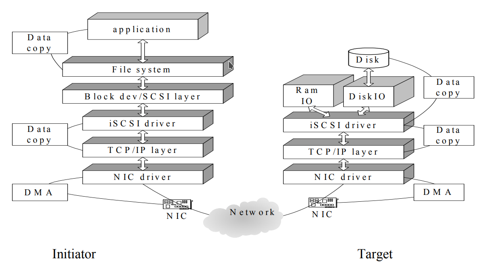

# Criando um Storage iSCSI a partir de um Servidor Linux

## Objetivo

Este guia demonstra como transformar um servidor Linux em um Storage iSCSI utilizando o **targetcli-fb**, disponibilizando dispositivos de bloco para clientes através da rede IP. Ao final do procedimento, também é apresentada a configuração de um cliente Linux utilizando **open-iscsi** para acesso aos volumes publicados.

---

## O que é iSCSI

O **Internet Small Computer System Interface (iSCSI)** é um protocolo que transporta comandos SCSI sobre redes TCP/IP, permitindo que dispositivos de armazenamento sejam disponibilizados remotamente como dispositivos de bloco.


Diferentemente de compartilhamentos de arquivos (NFS ou SMB), o iSCSI apresenta o dispositivo remoto ao sistema operacional como um disco local. Dessa forma, o cliente pode particionar, formatar e utilizar qualquer sistema de arquivos suportado pelo sistema operacional.

Entre as principais vantagens do iSCSI destacam-se:

* utilização da infraestrutura Ethernet existente;
* menor custo quando comparado ao Fibre Channel;
* acesso em nível de bloco;
* compatibilidade com diversos sistemas operacionais e hipervisores.

### Terminologia

| Termo     | Descrição                                                                       |
| --------- | ------------------------------------------------------------------------------- |
| Initiator | Máquina cliente que acessa o armazenamento.                                     |
| Target    | Servidor que disponibiliza os dispositivos de armazenamento.                    |
| IQN       | Identificador único utilizado por Initiators e Targets.                         |
| LUN       | Unidade lógica disponibilizada ao cliente.                                      |
| Backstore | Dispositivo físico, LVM, arquivo ou outro recurso utilizado como armazenamento. |

> **Observação**
>
> Existem outras tecnologias para transporte de armazenamento em rede, como Fibre Channel, FCoE, AoE e iFCP. O iSCSI utiliza a infraestrutura IP tradicional, simplificando sua implantação.

---

## Arquitetura

A comunicação ocorre entre um **Initiator** e um **Target**, utilizando a rede IP.

>
> 
>
> Diagrama ilustrando:
>
> Cliente → Rede TCP/IP → Servidor iSCSI → Disco/LVM

---

# Pré-requisitos

Servidor Linux com:

* acesso administrativo;
* pacote `targetcli-fb`;
* dispositivo de armazenamento disponível (disco, partição ou volume LVM).

Cliente Linux com:

* pacote `open-iscsi`.

---

# Instalação do Servidor

## Instalando o targetcli

```bash
apt-get update
apt-get install -y targetcli-fb
```

---

## Otimização do Kernel

Os parâmetros abaixo aumentam os buffers TCP utilizados pelo iSCSI.

```bash
cat <<EOF >> /etc/sysctl.conf
net.core.netdev_max_backlog = 5000
net.core.rmem_max = 16777216
net.core.wmem_max = 16777216
net.ipv4.tcp_rmem = 4096 87380 16777216
net.ipv4.tcp_wmem = 4096 87380 16777216
net.ipv4.tcp_window_scaling = 1
EOF

sysctl -p
```

> Estes ajustes normalmente precisam ser realizados apenas uma vez.

---

# Configuração do Storage iSCSI

Neste exemplo será utilizado um volume LVM.

```
/dev/mapper/vg_storage-lv_lun01
```

Inicie o utilitário:

```bash
targetcli
```

---

## Criando o Backstore

Acesse o menu de blocos:

```text
/backstores/block/
```

Crie o objeto de armazenamento:

```text
create storage-lun01 /dev/mapper/vg_storage-lv_lun01
```

Saída esperada:

```text
Created block storage object storage-lun01 using /dev/mapper/vg_storage-lv_lun01
```

Valide:

```text
ls
```

> **Imagem sugerida**
>
> Resultado do comando `ls` após a criação do Backstore.

---

## Criando o Target

Acesse o menu iSCSI:

```text
/iscsi/
```

Crie um novo Target.

Exemplo de IQN:

```text
iqn.2026-07.com.example:storage01
```

```text
create iqn.2026-07.com.example:storage01
```

O Target criará automaticamente:

* TPG1
* Portal TCP 3260

Valide:

```text
ls
```

> **Imagem sugerida**
>
> Estrutura do Target criada.

---

## Criando a LUN

Entre no diretório:

```text
/iscsi/iqn.2026-07.com.example:storage01/tpg1/luns
```

Crie a LUN:

```text
create lun=0 storage_object=/backstores/block/storage-lun01
```

Saída esperada:

```text
Created LUN 0.
```

Valide novamente:

```text
ls
```

---

## Ajustando os atributos do Target

Retorne ao TPG:

```text
../
```

Configure:

```text
set attribute authentication=0 demo_mode_write_protect=0
```

Resultado esperado:

```text
Parameter authentication is now '0'
Parameter demo_mode_write_protect is now '0'
```

> **Importante**
>
> Este exemplo desabilita autenticação CHAP para simplificar o laboratório. Em ambientes de produção recomenda-se utilizar autenticação adequada e restringir o acesso aos Initiators autorizados.

---

## Criando ACLs

Entre no menu:

```text
cd acls
```

Cadastre os clientes autorizados.

Cliente 01:

```text
create iqn.2026-07.com.example:node01
```

Cliente 02:

```text
create iqn.2026-07.com.example:node02
```

Cada ACL criada mapeará automaticamente a LUN.

Valide:

```text
ls
```

---

## Salvando a Configuração

Retorne à raiz:

```text
/
```

Salve a configuração:

```text
saveconfig
```

---

## Removendo Objetos

Os objetos devem ser removidos respeitando a hierarquia.

A ordem recomendada é:

1. ACL
2. LUN
3. Target
4. Backstore

Utilize sempre o comando:

```text
delete
```

no nível correspondente.

---

# Configuração do Cliente Linux

## Instalação

```bash
apt-get update
apt-get install -y open-iscsi
```

---

## Definindo o IQN

Edite:

```text
/etc/iscsi/initiatorname.iscsi
```

Exemplo:

```text
InitiatorName=iqn.2026-07.com.example:node01
```

Cada cliente deve possuir um IQN exclusivo.

---

## Inicializando o Serviço

```bash
systemctl enable open-iscsi
systemctl start open-iscsi
```

---

## Próximos Passos

Após configurar o cliente, normalmente as próximas etapas são:

* descobrir os Targets disponíveis;
* realizar o login no Target;
* verificar a criação do dispositivo de bloco;
* particionar e formatar o volume, quando necessário;
* montar o sistema de arquivos ou utilizá-lo conforme a aplicação.

> **Observação**
>
> Estes procedimentos podem ser adicionados posteriormente para completar o fluxo de utilização do iSCSI.

---

# Problemas Comuns

* IQN do cliente não cadastrado nas ACLs.
* Porta TCP 3260 bloqueada por firewall.
* Serviço `targetcli` não salvo corretamente.
* Volume LVM inexistente ou indisponível.
* IQNs duplicados em mais de um cliente.

---

# Considerações de Segurança

* Utilize IQNs exclusivos para cada cliente.
* Restrinja as ACLs apenas aos hosts autorizados.
* Utilize autenticação CHAP em ambientes de produção.
* Limite o acesso à porta TCP 3260 por firewall.
* Monitore o uso do armazenamento e da rede.

---

# Referências

* RFC 3720 — Internet Small Computer Systems Interface (iSCSI)
* Documentação do `targetcli-fb`
* Documentação do `open-iscsi`
