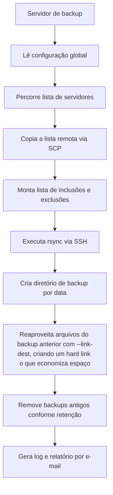

# Backup Linux

## Downloads

* [backup_sistemas.sh](../../downloads/scripts/backup_sistemas/backup_sistemas.sh)
* [backup_geral.conf](../../downloads/scripts/backup_sistemas/backup_geral.conf)

## Objetivo

Este documento descreve o funcionamento do script `backup_sistemas.sh`, utilizado para executar backups de servidores Linux por meio de `ssh` e `rsync`.

O objetivo do script é manter cópias históricas de diretórios e arquivos definidos em cada servidor, com retenção simples, paralelismo controlado e reaproveitamento de arquivos já existentes por meio de hard links.

O script foi pensado para ambientes onde:

* existe um servidor central de backup;
* os servidores clientes aceitam conexão SSH por chave;
* cada cliente informa o que deve ser incluído ou excluído;
* o backup precisa ser simples de auditar no sistema de arquivos;
* a restauração deve poder ser feita com ferramentas Linux comuns;
* o backup deve economizar no espaço alocado;
* o acesso do backup deve ocorrer apenas do servidor de backup para as maquinas, nunca o contrário.

## Contexto

O `backup_sistemas.sh` é um script shell mantido ao longo de vários anos para resolver um problema prático: fazer backup de vários servidores Linux sem depender de um agente instalado em cada máquina.

Cada servidor remoto mantém um arquivo de definição local. Em uma versão pública do script, recomenda-se usar um nome genérico, por exemplo:

```text
/root/.backup_sistemas
```

O caminho exato deve ser o mesmo utilizado no script publicado. Se a versão original usa um nome interno ou corporativo, ajuste esse nome antes de disponibilizar o código em um repositório público.

Esse arquivo informa quais caminhos entram no backup e quais padrões devem ser excluídos.

O servidor de backup lê essa lista por `scp`, executa o `rsync` por SSH e grava o resultado em uma estrutura de diretórios organizada por servidor e data.

## Visão geral da arquitetura



### Script principal

```text
backup_sistemas.sh
```

Responsável por:

* carregar a configuração global;
* controlar locks de execução;
* buscar a lista de backup em cada servidor;
* executar os processos de sincronização;
* respeitar o limite de backups simultâneos;
* aplicar retenção;
* gerar logs;
* enviar relatório por e-mail.

### Arquivo de configuração global

```text
backup_geral.conf
```

Define parâmetros como:

* lista de servidores;
* diretório temporário;
* diretório base dos backups;
* quantidade máxima de backups simultâneos;
* retenção em dias;
* dados do servidor SMTP;
* caminho do `netcat`.

Exemplo genérico:

```bash
Servers="srv-web-01 srv-db-01 srv-app-01:2222"
Dir_Temp="/var/tmp"
Dir_Backup="/backup"
Backups_Simultaneos=4
Retensao=7
Email="admin@example.net"
EMAIL_FROM="backup@example.net"
EMAIL_SERVER="mail.example.net"
EMAIL_PORT="25"
NC="/usr/bin/nc"
```

### Arquivo remoto de definição do backup

Cada servidor cliente deve possuir um arquivo de definição do backup. Exemplo para uma versão pública:

```text
/root/.backup_sistemas
```

O formato esperado possui duas colunas:

```text
I /caminho/incluido
E padrao_excluido
```

Onde:

* `I` indica caminho incluído no backup;
* `E` indica padrão ou caminho excluído;
* cada linha válida deve possuir exatamente dois campos.

Exemplo:

```text
I /etc
I /home
I /var/www
E cache
E *.tmp
E /home/usuario/downloads
```

As exclusões são aplicadas com a opção `--exclude-from` do `rsync`.

## Pré-requisitos

No servidor de backup:

* Bash;
* `rsync`;
* `ssh`;
* `scp`;
* `awk`;
* `sed`;
* `mktemp`;
* `md5sum`;
* `base64`;
* `netcat`;
* espaço em disco suficiente no diretório de backup.

Nos servidores clientes:

* serviço SSH ativo;
* acesso do servidor de backup ao usuário autorizado;
* chave pública cadastrada no `authorized_keys`;
* arquivo de definição do backup criado e revisado.

## Funcionamento passo a passo

### 1. Carregamento da configuração

O script identifica o diretório onde está sendo executado e carrega o arquivo de configuração:

```bash
. ${basedir}/backup_geral.conf
```

Isso permite atualizar o script sem perder a configuração do ambiente.

### 2. Criação de logs e status

O script cria arquivos temporários de log no diretório:

```text
${Dir_Backup}/Log
```

Durante a execução são registrados:

* horário de início;
* PID do processo;
* espaço ocupado no filesystem;
* servidor processado;
* caminho sincronizado;
* erros do `rsync`;
* remoção de backups antigos;
* envio do relatório final.

### 3. Controle de execução concorrente

O script utiliza arquivos de lock para evitar execuções simultâneas acima do limite desejado.

Existe um lock geral por execução:

```text
${Dir_Backup}/Log/.lock_<PID>
```

E um lock por servidor:

```text
${Dir_Backup}/${server}/.lock
```

Esse controle evita que duas execuções tentem gravar no mesmo destino ao mesmo tempo.

### 4. Coleta da lista remota

Para cada servidor configurado, o script tenta copiar:

```text
servidor:/root/.backup_sistemas
```

para o diretório temporário local.

Se o arquivo não existir ou não puder ser copiado, o servidor é ignorado e o fato é registrado no log.

### 5. Preparação das exclusões

As linhas iniciadas por `E` são extraídas para um arquivo temporário de exclusões.

Esse arquivo é usado no `rsync`:

```bash
--exclude-from=<arquivo_temporario>
```

Linhas vazias são ignoradas. Linhas fora do formato esperado são registradas como erro no log do servidor.

### 6. Execução do rsync

Para cada linha iniciada por `I`, o script executa o `rsync` contra o servidor remoto.

Quando não existe backup anterior, a sincronização é feita diretamente.

Quando existe backup anterior, o script usa:

```bash
--link-dest=<backup_anterior>
```

Com isso, arquivos que não mudaram entre um backup e outro podem ser reaproveitados por hard link, reduzindo o consumo de espaço em disco.

As opções principais utilizadas pelo `rsync` são:

```bash
-arugtpl
--numeric-ids
--delete
--exclude-from=<arquivo>
--link-dest=<backup_anterior>
```

Resumo das opções:

* `-a`: modo archive;
* `-r`: recursivo;
* `-u`: não sobrescreve arquivos mais novos no destino;
* `-g`: preserva grupo;
* `-t`: preserva data;
* `-p`: preserva permissões;
* `-l`: preserva links simbólicos;
* `--numeric-ids`: preserva IDs numéricos de usuários e grupos;
* `--delete`: remove no destino arquivos removidos na origem;
* `--link-dest`: reaproveita arquivos iguais do backup anterior.

## Estrutura dos backups

A estrutura criada segue o padrão:

```text
/backup/
    servidor-01/
        202607170100/
        202607180100/
        Log/
            202607170100.log
            202607180100.log
    servidor-02/
        202607170100/
        202607180100/
        Log/
            202607170100.log
            202607180100.log
    Log/
        sys_sistema.log
```

O nome do diretório de cada execução utiliza o formato:

```text
YYYYMMDDHHMM
```

Exemplo:

```text
202607170130
```

## Retenção

Ao final da execução, o script percorre os diretórios de cada servidor e remove backups mais antigos que o período definido em:

```bash
Retensao=7
```

Existe uma proteção para evitar remover histórico quando o número de backups existentes estiver abaixo do esperado. Essa proteção reduz o risco de apagar os últimos backups disponíveis quando um servidor deixa de executar novos backups por falha de acesso, SSH ou configuração.

## Relatório por e-mail

Depois da conclusão, o script monta uma mensagem MIME em texto e envia o relatório usando `netcat` contra o servidor SMTP configurado.

Esse método evita depender de um MTA local, mas exige que o servidor SMTP aceite o envio a partir do servidor de backup.

## Exemplo de execução

Execução manual:

```bash
./backup_sistemas.sh
```

Execução recomendada por agendamento:

```cron
30 1 * * * /opt/backup/backup_sistemas.sh >/dev/null 2>&1
```

Antes de colocar em produção, execute manualmente com poucos servidores e valide os logs.

## Validações recomendadas

Antes de confiar no backup:

* confirme se todos os servidores possuem o arquivo remoto de definição do backup;
* teste o SSH sem senha a partir do servidor de backup;
* valide se a porta SSH configurada está correta;
* confira se o diretório de destino possui espaço suficiente;
* revise as exclusões para evitar remover dados importantes do backup;
* faça restauração de teste;
* monitore o crescimento do diretório de backup;
* acompanhe os logs após cada alteração.

Comandos úteis:

```bash
ssh -p 22 servidor.example.net true
scp -P 22 servidor.example.net:/root/.backup_sistemas /tmp/backup_sistemas.teste
rsync -avn --delete servidor.example.net:/etc/ /backup/teste/etc/
```

## Restauração

Como o resultado do backup é uma árvore de arquivos comum, a restauração pode ser feita com `rsync` ou cópia direta.

Exemplo:

```bash
rsync -aHAX /backup/servidor-01/202607170130/etc/ /restore/servidor-01/etc/
```

Ao restaurar para o servidor original, revise antes:

* permissões;
* donos e grupos;
* links simbólicos;
* serviços que precisam ser parados;
* risco de sobrescrever arquivos atuais;
* compatibilidade dos IDs numéricos de usuários e grupos.


## Limitações conhecidas

O script é simples e eficaz, mas possui limitações importantes:

* depende de SSH funcional em todos os servidores;
* não criptografa os dados armazenados no destino;
* não faz deduplicação por bloco;
* não possui catálogo de arquivos;
* não possui verificação automática de restauração;
* usa locks por arquivo especial, o que exige limpeza se uma execução for interrompida de forma anormal;
* o envio de e-mail depende de conectividade direta com o SMTP;
* os logs devem ser acompanhados por monitoramento externo.


## Conclusão

O `backup_sistemas.sh` resolve um caso clássico de infraestrutura Linux: backup centralizado, baseado em ferramentas nativas e com baixo acoplamento aos servidores clientes. O uso de hard link diminui consideravelmente o espaço alocado pelo backup, pois arquivos repetidos só são gravados uma unica vez.

Sua principal vantagem é a transparência. O resultado fica disponível no sistema de arquivos, backups, organizado por servidor e data, podendo ser auditado e restaurado sem depender de uma aplicação específica.
