# Migração de servidor Kubernetes de RAID1 SATA para RAID1 SSD sem reinstalação

| Informação | Valor |
| --- | --- |
| Tipo | Estudo de caso |
| Categoria | Storage / Kubernetes / Recuperação |
| Nível | Avançado |
| Status | Analisado e Corrigido |
| Versão | 4 |
| Data da revisão | 2026-07-30 |

---

## Capa

**MORENO.ECO.BR**

Engenharia de Infraestrutura Linux

**Estudo de caso técnico**

Migração de servidor Kubernetes de RAID1 SATA para RAID1 SSD sem reinstalação.

Este documento descreve uma migração real, anonimizada, envolvendo sistema operacional Linux, LVM, RAID por controladora IBM ServeRAID, GRUB, Kubernetes, containerd e sincronização com `rsync`.


---

## Índice

1. Objetivo
2. Resumo executivo
3. Ambiente
4. Arquitetura antes da migração
5. Arquitetura depois da migração
6. Motivação da migração
7. Premissas e restrições
8. Estudo das alternativas
9. Estratégia adotada
10. Preparação do novo RAID
11. Preparação do LVM
12. Formatação dos volumes
13. Preparação do Kubernetes
14. Parada controlada
15. Montagem da nova raiz
16. Sincronização com rsync
17. Chroot
18. GRUB e initramfs
19. MegaCLI e ordem de boot
20. Primeiro boot
21. Recuperação do Kubernetes
22. Problemas encontrados
23. Validações
24. Lições aprendidas
25. Conclusão
26. Apêndice A: comandos utilizados
27. Apêndice B: saídas relevantes
28. Apêndice C: evidências em imagem
29. Apêndice D: checklist de sanitização

---

## Objetivo

Documentar a migração integral de um servidor Linux com Kubernetes de um RAID1 em discos SATA mecânicos para um novo RAID1 em SSD, sem reinstalação do sistema operacional e sem reconstrução do cluster a partir do zero.

O objetivo técnico foi preservar:

- sistema operacional;
- estrutura LVM;
- volumes de dados;
- configuração do Kubernetes;
- dados utilizados por containers;
- configuração de boot;
- possibilidade de retorno ao RAID antigo em caso de falha.

O objetivo operacional foi reduzir a latência de I/O observada no ambiente, principalmente nos componentes sensíveis a escrita e sincronização, como o `etcd`.

---

## Resumo executivo

O ambiente original executava Linux com Kubernetes sobre uma estrutura baseada em LVM armazenada em um RAID1 com discos SATA. O desempenho de I/O do armazenamento mecânico passou a impactar a estabilidade operacional do ambiente, especialmente durante operações de escrita e recuperação dos componentes do Kubernetes.

A solução adotada foi criar um novo RAID1 com SSDs, montar uma nova estrutura LVM equivalente, formatar os volumes, parar o Kubernetes de forma controlada, sincronizar o sistema com `rsync`, preparar o novo sistema via `chroot`, reinstalar o GRUB e alterar o Virtual Drive de boot na controladora IBM ServeRAID M1015 com MegaCLI.

A migração foi concluída com sucesso. O sistema operacional, os volumes, a configuração do Kubernetes e os dados foram preservados. O RAID antigo foi mantido intacto durante a mudança, funcionando como plano de retorno.

---

## Ambiente

| Item | Descrição anonimizada |
| --- | --- |
| Sistema operacional | Linux |
| Função do servidor | Nó com Kubernetes |
| Armazenamento original | RAID1 com discos SATA |
| Armazenamento novo | RAID1 com SSD |
| Controladora | IBM ServeRAID M1015 |
| Gerenciamento da controladora | MegaCLI |
| Gerenciamento de volumes | LVM |
| Runtime de containers | containerd |
| Orquestração | Kubernetes |
| Método de cópia | rsync |
| Bootloader | GRUB |

---

## Arquitetura antes da migração

Antes da migração, o servidor inicializava a partir de um Virtual Drive configurado na controladora RAID. Esse Virtual Drive apresentava um volume físico LVM ao sistema operacional.

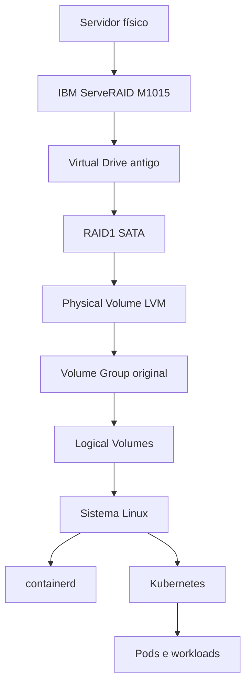
```mermaid
flowchart TD
    A[Servidor físico] --> B[IBM ServeRAID M1015]
    B --> C[Virtual Drive antigo]
    C --> D[RAID1 SATA]
    D --> E[Physical Volume LVM]
    E --> F[Volume Group original]
    F --> G[Logical Volumes]
    G --> H[Sistema Linux]
    H --> I[containerd]
    H --> J[Kubernetes]
    J --> K[Pods e workloads]
```

### Características do cenário original

- O RAID antigo permanecia funcional.
- A estrutura LVM concentrava volumes do sistema e de dados.
- O Kubernetes dependia da consistência dos volumes locais.
- O `etcd` era sensível ao comportamento do armazenamento.
- Uma reinstalação completa aumentaria risco e tempo de indisponibilidade.

---

## Arquitetura depois da migração

Após a migração, o servidor passou a inicializar a partir de um novo Virtual Drive associado ao RAID1 SSD.

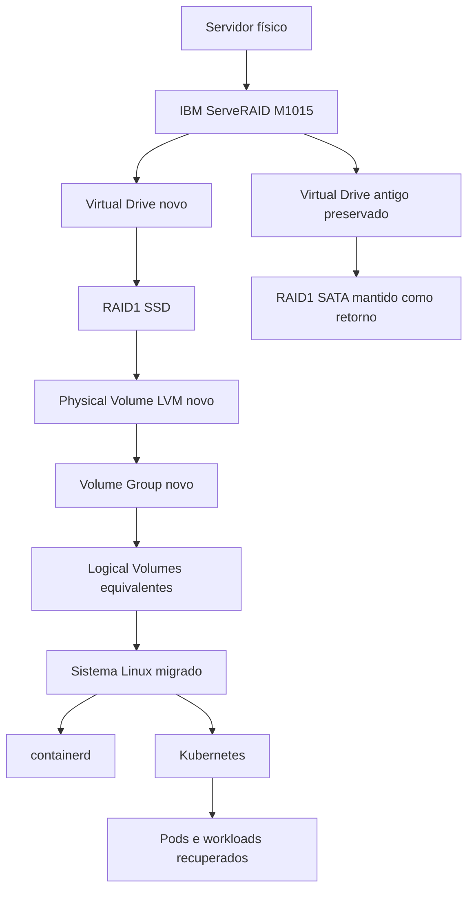
```mermaid
flowchart TD
    A[Servidor físico] --> B[IBM ServeRAID M1015]
    B --> C[Virtual Drive novo]
    C --> D[RAID1 SSD]
    D --> E[Physical Volume LVM novo]
    E --> F[Volume Group novo]
    F --> G[Logical Volumes equivalentes]
    G --> H[Sistema Linux migrado]
    H --> I[containerd]
    H --> J[Kubernetes]
    J --> K[Pods e workloads recuperados]

    B --> L[Virtual Drive antigo preservado]
    L --> M[RAID1 SATA mantido como retorno]
```

### Resultado esperado

- Boot pelo novo RAID SSD.
- Estrutura de volumes preservada.
- Sistema operacional iniciado sem reinstalação.
- Kubernetes recuperado após liberação controlada.
- RAID antigo preservado até homologação.

---

## Motivação da Migração

O servidor Kubernetes executava o sistema operacional e o etcd, responsável pelo armazenamento do estado do cluster, sobre um conjunto de discos SATA mecânicos configurados em RAID1.

Durante a operação foram observados tempos excessivos de resposta das operações de entrada e saída (I/O), elevando significativamente a latência do subsistema de armazenamento. Como o etcd depende de gravações síncronas e de baixa latência para manter o estado do cluster, esse comportamento comprometia diretamente o funcionamento do Kubernetes.

As consequências eram percebidas na operação diária do ambiente, incluindo:

- aumento da latência nas operações do etcd;
- degradação do tempo de resposta da API do Kubernetes;
- atrasos na comunicação entre os componentes do cluster;
- falhas na criação e inicialização de Pods;
- encerramento inesperado de Pods durante períodos de maior atividade;
- aumento do tempo de recuperação após reinicializações;
- indisponibilidades ocasionais de serviços hospedados no cluster.

A análise do ambiente demonstrou que a limitação não estava relacionada à capacidade de armazenamento, mas ao elevado tempo de resposta do conjunto de discos mecânicos. O subsistema de armazenamento havia se tornado o principal gargalo do ambiente, impedindo que o Kubernetes e, principalmente, o etcd, operassem dentro dos requisitos de desempenho necessários para manter a estabilidade do cluster.

Diante desse cenário, foi definida a substituição do armazenamento principal por um novo conjunto de discos SSD configurados em RAID1. A migração teve como objetivo eliminar o gargalo de I/O, reduzir a latência do armazenamento e restabelecer a estabilidade operacional do cluster, preservando integralmente a instalação existente por meio da migração do sistema operacional e de seus dados, sem necessidade de reinstalação do servidor.

---

## Premissas e Restrições

### Premissas

- O RAID antigo deveria permanecer intacto durante a migração.
- O sistema operacional não deveria ser reinstalado.
- A estrutura de volumes deveria ser reproduzida no novo armazenamento.
- O Kubernetes deveria ser parado de forma controlada antes da cópia final.
- A alteração do boot deveria ocorrer somente depois da validação do novo sistema.

### Restrições

- A janela de manutenção deveria ser controlada.
- A cópia precisava preservar permissões, donos, links, atributos e arquivos especiais.
- Volumes montados por containers não poderiam permanecer ativos durante a sincronização final.
- A controladora RAID exigia alteração explícita do Virtual Drive de boot.

---

## Estratégia adotada

O fluxo geral da migração foi:

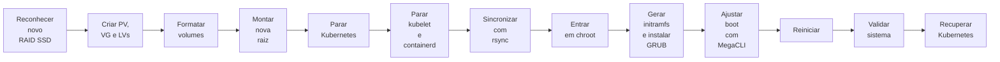
```mermaid
flowchart LR
    A[Reconhecer<br>novo<br>RAID SSD] --> B[Criar PV,<br>VG e LVs]
    B --> C[Formatar<br>volumes]
    C --> D[Montar<br>nova<br>raiz]
    D --> E[Parar<br>Kubernetes]
    E --> F[Parar<br>kubelet<br> e<br>containerd]
    F --> G[Sincronizar<br>com<br>rsync]
    G --> H[Entrar<br>em chroot]
    H --> I[Gerar<br>initramfs<br>e instalar<br>GRUB]
    I --> J[Ajustar<br>boot<br>com<br>MegaCLI]
    J --> K[Reiniciar]
    K --> L[Validar<br>sistema]
    L --> M[Recuperar<br>Kubernetes]
    
```

Essa sequência reduziu o risco porque cada etapa produzia uma evidência verificável antes da próxima.

---

## Preparação do novo RAID

O primeiro passo foi validar que a controladora reconhecia os discos SSD e apresentava o novo Virtual Drive ao sistema.

### Verificações necessárias

Após a instalação física dos discos SSD e a criação do novo arranjo RAID1 na controladora IBM ServeRAID M1015, o primeiro procedimento consistiu em validar se o novo Virtual Drive havia sido criado corretamente e encontrava-se operacional.

Essa etapa garante que o novo armazenamento está íntegro antes de qualquer intervenção no sistema operacional, evitando iniciar uma migração sobre um volume com falhas de configuração ou degradação do RAID.

A verificação foi realizada utilizando o utilitário MegaCLI, consultando diretamente as informações dos discos virtuais configurados na controladora.

Itens verificados:

- reconhecimento dos dois discos SSD pela controladora;
- criação do novo Virtual Drive em RAID1;
- estado operacional do volume (Optimal);
- capacidade aproximada de 1 TB;
- políticas de acesso e cache aplicadas ao novo volume;
- preservação do Virtual Drive original, garantindo que o sistema em produção permanecesse íntegro durante toda a preparação.
  
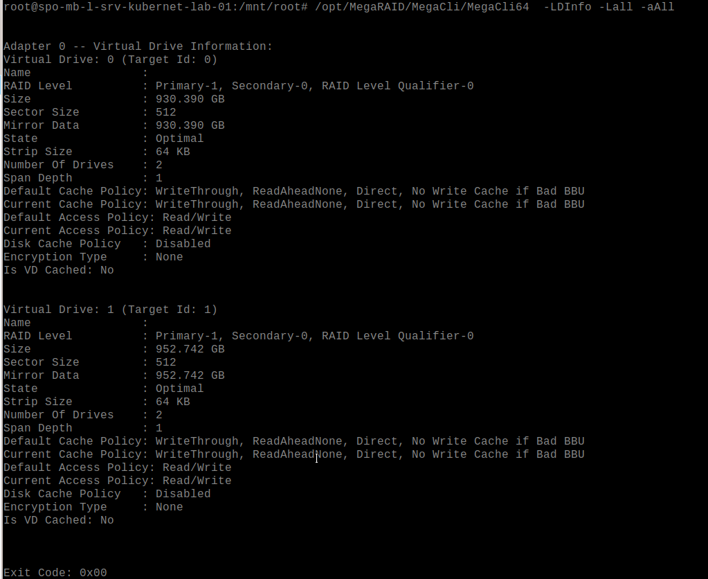

A saída do MegaCLI confirma que a controladora reconhece dois discos virtuais configurados em RAID1. O Virtual Drive 0 corresponde ao armazenamento atualmente utilizado pelo sistema operacional, enquanto o Virtual Drive 1 representa o novo conjunto de discos SSD preparado para receber a migração.

Ambos os volumes encontram-se com estado Optimal, indicando que a sincronização do espelhamento foi concluída com sucesso e que não havia falhas de hardware que impedissem o prosseguimento da migração.

Outro aspecto relevante observado é que ambos os volumes estavam operando com a política de cache:

```
WriteThrough
ReadAheadNone
Direct
No Write Cache if Bad BBU
```

Essa configuração é compatível com a ausência de uma bateria funcional (BBU) na controladora, priorizando a integridade dos dados em detrimento do desempenho de escrita. Embora essa política aumente a latência das operações de gravação, ela elimina o risco de perda de dados em caso de interrupção inesperada de energia.

Com a confirmação do estado operacional do novo Virtual Drive, foi possível prosseguir para a etapa seguinte, na qual o sistema operacional reconhece o novo dispositivo de armazenamento como um novo disco disponível para particionamento e preparação da migração.

---

## Definição da estratégia de migração

Antes do início da migração foi analisada a melhor estratégia para transferir o sistema operacional do RAID mecânico para o novo RAID SSD, preservando a instalação existente e reduzindo o tempo de indisponibilidade do ambiente.

Inicialmente foi considerada a utilização da ferramenta **dd**, realizando uma cópia integral das partições existentes para o novo disco. Essa abordagem apresentava como principal vantagem a preservação exata do conteúdo das partições, incluindo sistemas de arquivos, UUIDs e estruturas de inicialização, reduzindo significativamente a necessidade de ajustes posteriores.

Entretanto, durante o planejamento observou-se que essa estratégia era adequada apenas para as pequenas partições de inicialização. A aplicação do mesmo procedimento sobre a partição principal, com aproximadamente **950 GB**, implicaria a cópia de todo o dispositivo em nível de bloco, incluindo áreas não utilizadas, aumentando significativamente o tempo de migração e a indisponibilidade do ambiente.

Diante dessa análise foi adotada uma estratégia híbrida:

- clonagem em nível de bloco (`dd`) apenas das partições de inicialização;
- recriação da estrutura LVM no novo RAID;
- migração do sistema de arquivos utilizando `rsync`, copiando apenas os dados efetivamente utilizados.

Essa abordagem preservou os componentes de boot do sistema, reduziu o tempo necessário para a migração da partição principal e permitiu reorganizar a estrutura lógica de armazenamento sem reinstalação do sistema operacional.

---

## Preparação do novo disco

Antes da transferência dos dados foi necessário preparar o novo Virtual Drive para receber a estrutura do sistema operacional.

Inicialmente foi analisada a tabela de partições do disco original, identificando sua organização e o tamanho de cada partição existente.

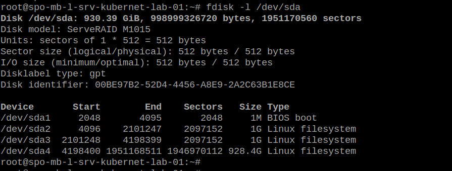

Em seguida, utilizando o utilitário **fdisk**, foi recriada manualmente uma estrutura equivalente no novo disco, preservando o layout necessário para o processo de inicialização e para a futura configuração do LVM.

Após a criação das partições foi realizada uma nova verificação da tabela de partições para confirmar que a estrutura do novo disco correspondia ao planejamento definido.

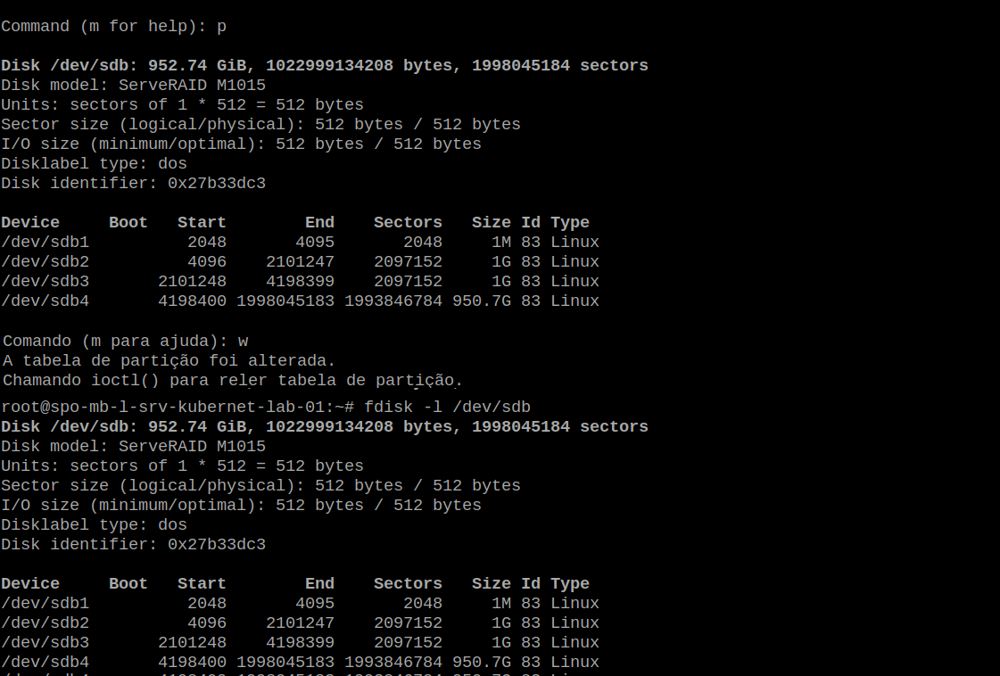

A sequência de comandos demonstra a inspeção da estrutura existente, a criação das novas partições e a validação final da tabela de partições antes do início da migração dos dados.

---

## Clonagem das partições de inicialização

Com a estrutura do novo disco preparada, iniciou-se a transferência das partições responsáveis pelo processo de inicialização do sistema.

Foram clonadas diretamente as seguintes partições:

```text
/dev/sda1  →  /dev/sdb1
/dev/sda2  →  /dev/sdb2
/dev/sda3  →  /dev/sdb3
```

A utilização do utilitário **dd** nessas partições permitiu preservar integralmente seu conteúdo, incluindo sistemas de arquivos, identificadores (UUIDs) e demais metadados, eliminando a necessidade de formatação ou recriação manual dessas estruturas.

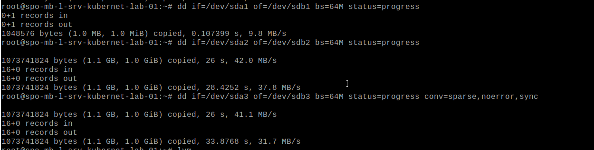

A captura de imagem demonstra a clonagem direta das três partições de inicialização utilizando o utilitário **dd**, preservando integralmente sua estrutura antes do início da migração do sistema de arquivos principal.

Como cada uma dessas partições possui aproximadamente **1 GB**, a operação foi concluída rapidamente, com baixo risco operacional.

Durante essa etapa foi reavaliada a possibilidade de aplicar o mesmo procedimento à partição principal do sistema. Contudo, considerando seu tamanho aproximado de **950 GB**, concluiu-se que a cópia integral em nível de bloco tornaria a migração demasiadamente demorada, além de copiar também grandes áreas sem dados úteis.

Essa constatação confirmou a decisão de utilizar **rsync** para a migração da partição principal, mantendo o `dd` exclusivamente para as pequenas partições de inicialização.

---

## Preparação da estrutura LVM

Concluída a preparação do novo disco, iniciou-se a criação da estrutura de gerenciamento de volumes que receberia o sistema operacional.

Antes de qualquer alteração, foi realizado um levantamento completo da configuração LVM existente no servidor, identificando a organização dos *Physical Volumes (PV)*, *Volume Groups (VG)* e *Logical Volumes (LV)* utilizados pelo ambiente em produção.

A análise demonstrou que todo o sistema estava concentrado em um único **Volume Group**, denominado **vg0**, contendo os volumes lógicos responsáveis pelo sistema operacional, áreas de dados e armazenamento dos containers.

### Estrutura original

| Logical Volume | Finalidade |
| --- | --- |
| backup | Área destinada aos backups locais |
| docker | Dados persistentes dos containers |
| home | Diretório `/home` |
| root | Sistema operacional |
| swap | Área de memória virtual |
| tmp | Diretório temporário |
| usr | Diretório `/usr` |
| var | Diretório `/var` |

Essa estrutura serviu como referência para a criação do novo ambiente de armazenamento.

### Criação do novo Volume Group

Embora fosse possível utilizar novamente o nome **vg0**, optou-se pela criação de um novo **Volume Group**, denominado **dados**.

Essa decisão permitiu que a estrutura antiga e a nova coexistissem durante toda a migração, reduzindo significativamente o risco operacional.

As principais vantagens dessa abordagem foram:

- evitar conflitos entre Volume Groups com o mesmo nome;
- preservar integralmente o ambiente original durante toda a migração;
- permitir a comparação entre as duas estruturas a qualquer momento;
- simplificar um eventual procedimento de retorno (rollback), caso necessário.

Durante todo o processo, o sistema operacional permaneceu utilizando exclusivamente o Volume Group **vg0**, enquanto a nova estrutura era preparada de forma independente no RAID SSD.

### Reprodução da estrutura lógica

Após a criação do novo Volume Group, foram recriados todos os Logical Volumes existentes no ambiente original, preservando a mesma organização lógica e os mesmos tamanhos.

| Logical Volume | Tamanho |
| --- | ---: |
| backup | 400 GB |
| docker | 350 GB |
| home | 5 GB |
| root | 30 GB |
| swap | 8 GB |
| tmp | 5 GB |
| usr | 30 GB |
| var | 30 GB |

A reprodução da estrutura original simplificou a migração do sistema de arquivos, mantendo a mesma organização administrativa já utilizada no ambiente em produção.

### Arquitetura adotada durante a migração

Durante toda a preparação coexistiram duas estruturas LVM completamente independentes:

```text
RAID Original
└── VG: vg0
    ├── root
    ├── var
    ├── usr
    ├── home
    ├── tmp
    ├── swap
    ├── docker
    └── backup

RAID SSD
└── VG: dados
    ├── root
    ├── var
    ├── usr
    ├── home
    ├── tmp
    ├── swap
    ├── docker
    └── backup
```

Essa separação foi uma das principais medidas de segurança adotadas durante a migração. Em nenhum momento houve alteração da estrutura LVM utilizada pelo sistema em produção, permitindo que todo o processo de preparação fosse realizado sem interferir no ambiente original.

### Evidências relacionadas

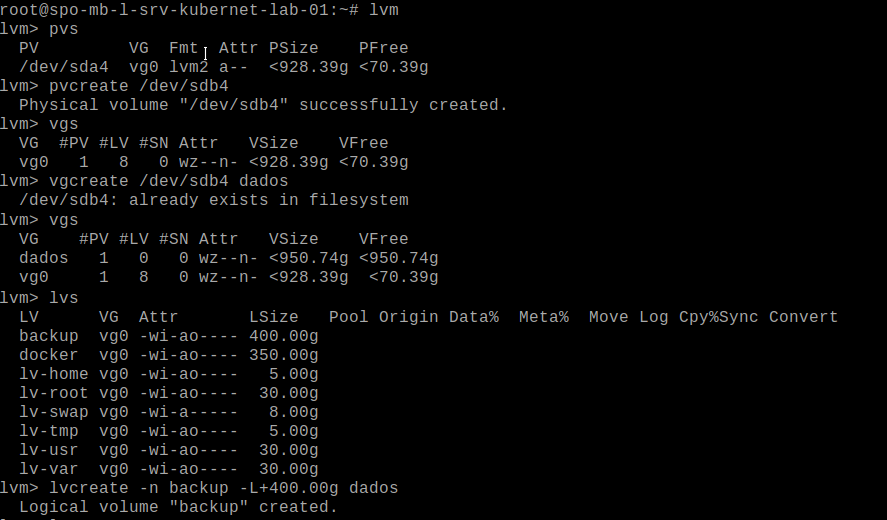

A primeira evidência apresenta a identificação da estrutura LVM existente, a criação do novo *Physical Volume* sobre o RAID SSD e a criação do novo **Volume Group** denominado **dados**, mantendo simultaneamente o **vg0** original.

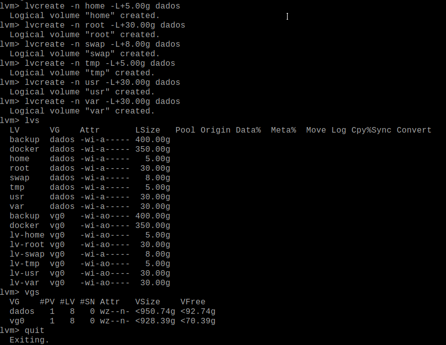

A segunda evidência demonstra a recriação dos Logical Volumes no novo Volume Group, preservando a mesma organização lógica existente no ambiente original e preparando o armazenamento para a migração dos dados utilizando `rsync`.

---

## Preparação dos sistemas de arquivos

Concluída a criação da estrutura LVM, iniciou-se a preparação dos sistemas de arquivos que receberiam os dados migrados do ambiente original.

Antes da formatação dos novos Logical Volumes, foi realizada uma análise do arquivo `/etc/fstab` do sistema em produção. O objetivo dessa verificação foi identificar os sistemas de arquivos utilizados em cada ponto de montagem, garantindo que a nova estrutura reproduzisse fielmente a configuração existente.

Essa etapa evitou suposições durante a migração e assegurou que cada volume fosse inicializado utilizando o mesmo sistema de arquivos empregado pelo servidor original.

### Análise da configuração existente

A consulta ao arquivo `/etc/fstab` permitiu identificar os pontos de montagem utilizados pelo sistema operacional, bem como os respectivos sistemas de arquivos associados a cada Logical Volume.

Essa informação serviu como referência para toda a preparação do novo ambiente de armazenamento.

### Evidência relacionada

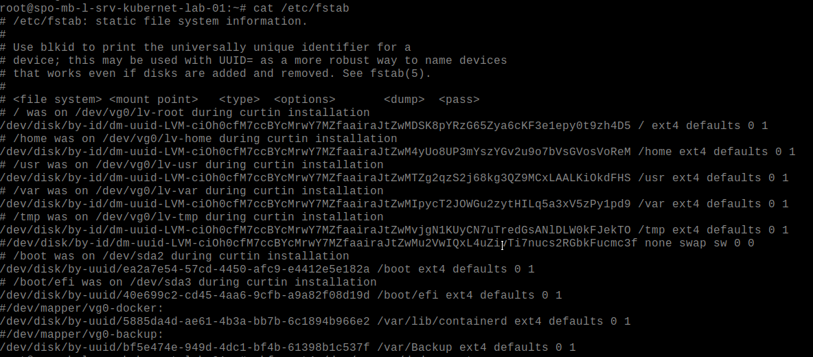

A imagem apresenta o conteúdo do arquivo `/etc/fstab` do ambiente original, utilizado como referência para identificar os sistemas de arquivos empregados em cada ponto de montagem antes da criação da nova estrutura.

### Formatação dos Logical Volumes

Com base nas informações obtidas no ambiente original, todos os Logical Volumes pertencentes ao Volume Group **dados** foram inicializados utilizando os mesmos sistemas de arquivos existentes no servidor em produção.

| Logical Volume | Sistema de arquivos |
| --- | --- |
| root | ext4 |
| usr | ext4 |
| var | ext4 |
| home | ext4 |
| tmp | ext4 |
| docker | ext4 |
| backup | ext4 |
| swap | swap |

A criação de novos sistemas de arquivos resultou na geração de novos UUIDs para cada volume. Esses identificadores foram posteriormente utilizados na reconstrução do arquivo `/etc/fstab` do ambiente migrado, garantindo que o sistema operacional montasse corretamente cada ponto de montagem após a inicialização pelo novo RAID.

### Evidências relacionadas

#### Formatação do volume raiz


#### Formatação do volume `/usr`

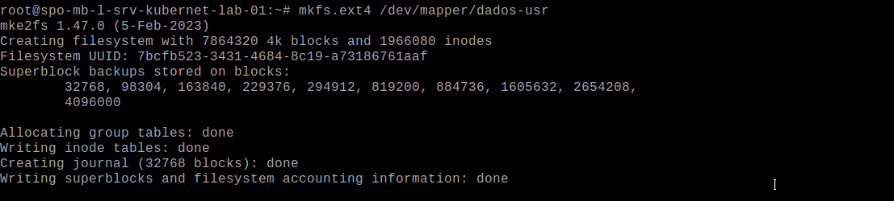

#### Formatação do volume `/var`

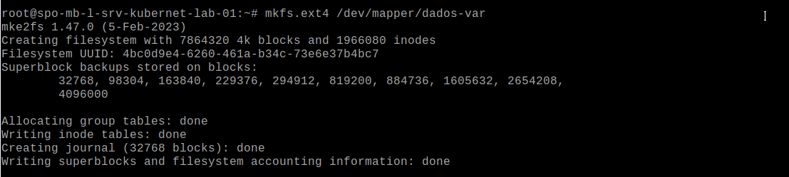

#### Formatação do volume `/home`

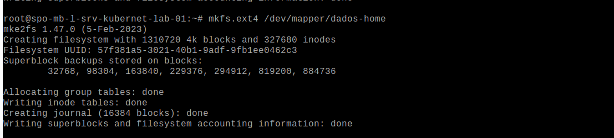

#### Formatação do volume `/tmp`

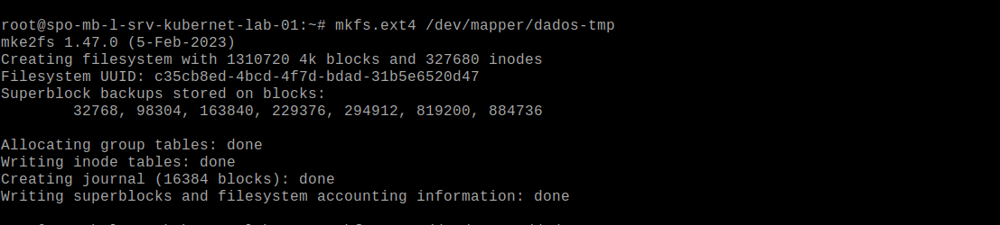

#### Inicialização da área de swap

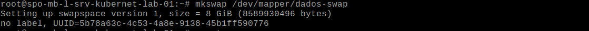

#### Formatação do volume destinado aos containers

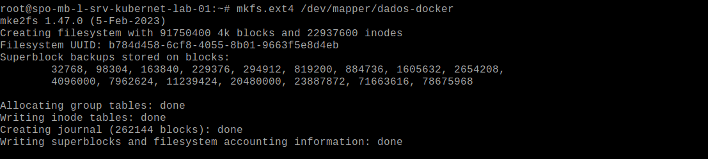

#### Formatação do volume de backup

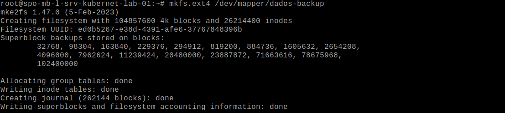

Ao final dessa etapa, toda a estrutura de armazenamento do novo RAID encontrava-se preparada para receber a migração dos dados do sistema operacional por meio do `rsync`.

---

## Preparação do Kubernetes para a migração

Antes da sincronização final do sistema operacional foi necessário colocar o ambiente Kubernetes em um estado consistente, eliminando qualquer escrita ativa sobre os volumes que seriam migrados.

O objetivo dessa etapa não era remover aplicações ou alterar a configuração do cluster, mas apenas interromper temporariamente sua execução, preservando integralmente os objetos Kubernetes para posterior restauração.

A sequência de ações adotada foi:

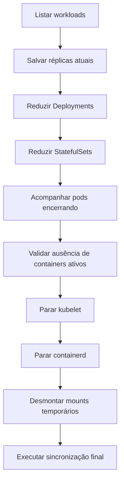
```mermaid
flowchart TD
    A[Listar workloads] --> B[Salvar réplicas atuais]
    B --> C[Reduzir Deployments]
    C --> D[Reduzir StatefulSets]
    D --> E[Acompanhar pods encerrando]
    E --> F[Validar ausência de containers ativos]
    F --> G[Parar kubelet]
    G --> H[Parar containerd]
    H --> I[Desmontar mounts temporários]
    I --> J[Executar sincronização final]
```
---

## Identificação do estado do cluster

Antes de iniciar a parada das cargas de trabalho foi realizado um levantamento do estado atual do ambiente.

Foram identificados:

- o nó responsável pela execução do cluster;
- os Pods ativos em todos os namespaces;
- os Deployments e StatefulSets existentes;
- a quantidade de réplicas configurada para cada workload.

Essas informações foram registradas antes da interrupção do ambiente, permitindo restaurar posteriormente a mesma configuração operacional.

### Evidências relacionadas

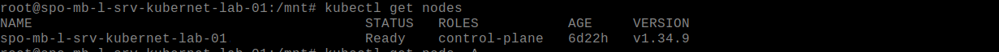

A imagem identifica o nó do cluster que seria submetido ao procedimento de migração.

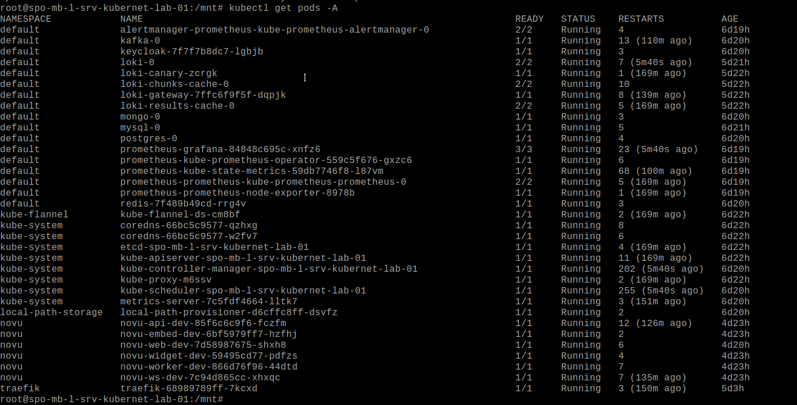

A consulta apresenta todos os Pods ativos no momento do início da migração.

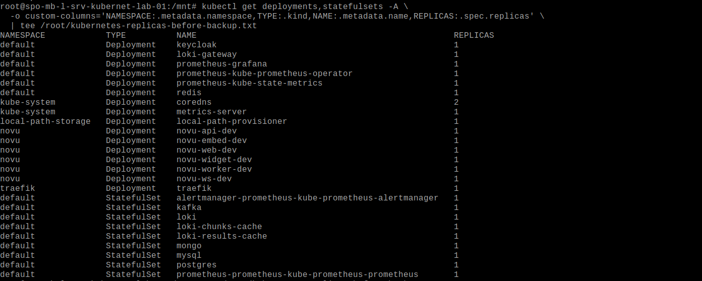

A relação de Deployments e StatefulSets foi utilizada para registrar previamente a quantidade de réplicas existente em cada carga de trabalho.

---

## Parada controlada das aplicações

Com o estado do cluster documentado, iniciou-se a redução controlada das cargas de trabalho.

Inicialmente todos os **Deployments** tiveram sua quantidade de réplicas reduzida para zero.

Na sequência, o mesmo procedimento foi aplicado aos **StatefulSets**, preservando sua configuração, porém interrompendo completamente sua execução.

Durante toda a operação foi realizado o acompanhamento da finalização dos Pods para verificar se todas as aplicações haviam encerrado corretamente.

Essa abordagem permitiu interromper a execução das aplicações sem remover qualquer configuração do Kubernetes.

### Evidências relacionadas

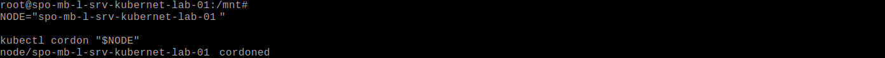

O nó foi marcado como indisponível para novos agendamentos (*cordon*), impedindo que novas cargas fossem distribuídas durante a migração.

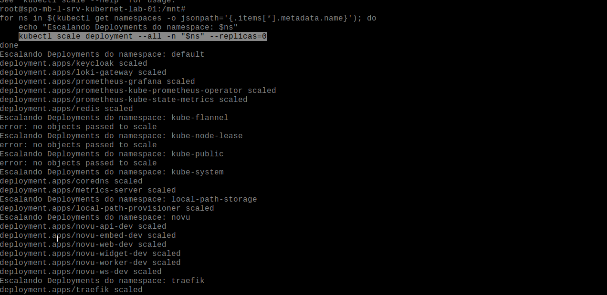

A imagem demonstra a redução controlada dos Deployments para zero réplicas.

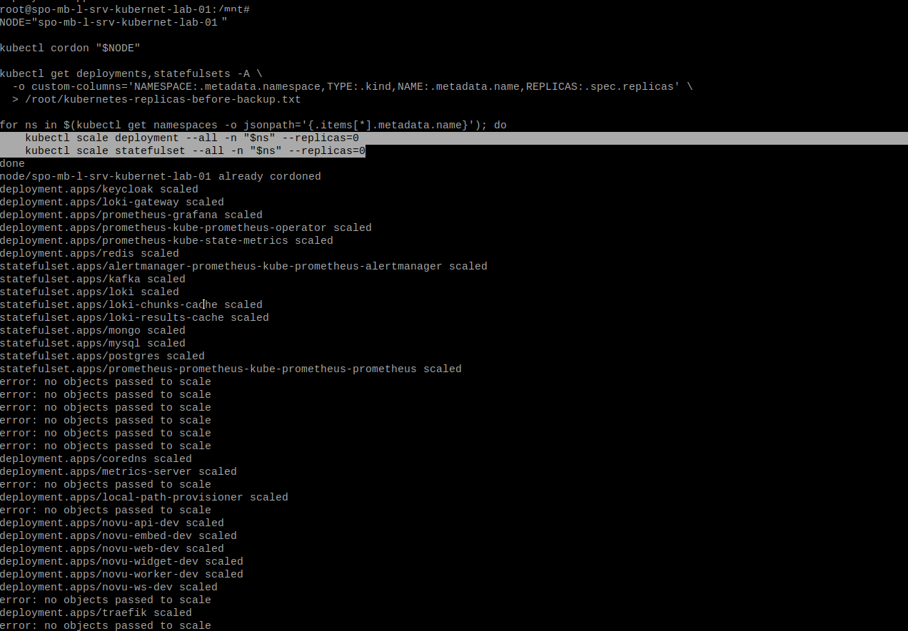

Na sequência foi aplicada a mesma estratégia aos StatefulSets existentes.

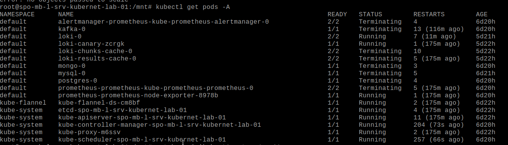

Durante todo o processo foi acompanhada a finalização gradual dos Pods até a interrupção das cargas de trabalho.

---

## Encerramento do runtime de containers

Após a parada das aplicações verificou-se que alguns containers permaneciam em execução.

Esse comportamento ocorre porque a interrupção das cargas de trabalho não encerra imediatamente todos os componentes do runtime de containers.

Para eliminar completamente qualquer atividade sobre os volumes do sistema, foi interrompido o serviço **kubelet**, impedindo novas tentativas de criação ou reinicialização de Pods.

Na sequência foi realizada uma inspeção direta do **containerd**, identificando as tarefas (*tasks*) ainda em execução.

Esses containers remanescentes foram encerrados inicialmente por meio dos mecanismos normais do runtime. Os processos que permaneceram ativos foram finalizados manualmente utilizando sinais do sistema operacional.

Essa etapa garantiu que nenhum processo permanecesse utilizando os sistemas de arquivos que seriam copiados durante a migração.

### Evidências relacionadas

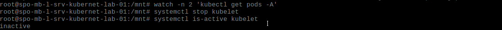

O serviço kubelet foi interrompido para impedir novas operações do Kubernetes durante a migração.

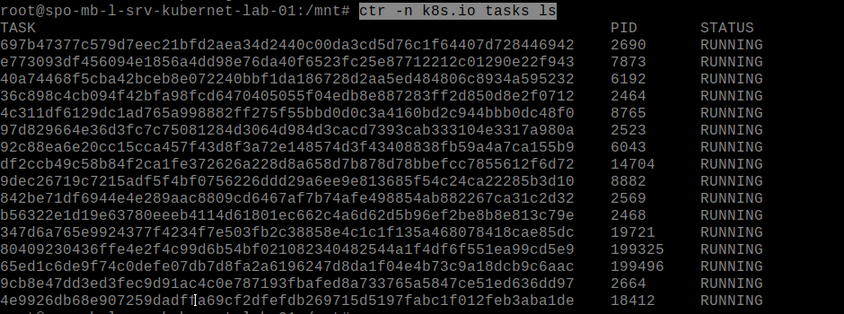

Mesmo após a interrupção das aplicações, ainda existiam tarefas ativas no containerd.

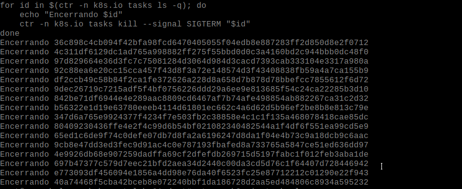

Realizou-se a finalização controlada das tarefas remanescentes.

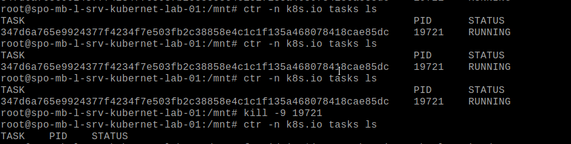

Os processos que permaneceram ativos foram encerrados manualmente, garantindo que não existissem containers em execução.

---

## Liberação dos pontos de montagem

Mesmo após o encerramento dos containers, ainda permaneciam ativos diversos sistemas de arquivos temporários criados pelo Kubernetes.

Esses pontos de montagem, pertencentes principalmente ao **containerd** e ao **kubelet**, poderiam manter referências abertas aos volumes do sistema e comprometer a consistência da sincronização dos dados.

Inicialmente foram desmontados todos os sistemas de arquivos associados ao **containerd**.

Na sequência foi aplicado o mesmo procedimento aos pontos de montagem pertencentes ao **kubelet**, repetindo a operação até que nenhuma montagem temporária permanecesse ativa.

Somente após essa validação o ambiente foi considerado completamente preparado para o início da sincronização do sistema operacional.

### Evidências relacionadas

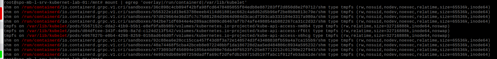

A inspeção identificou os sistemas de arquivos temporários ainda mantidos pelo Kubernetes.

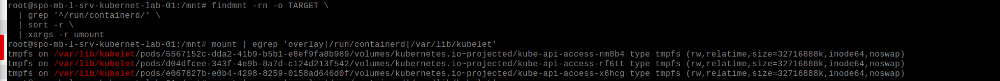

Realizou-se a desmontagem automatizada dos sistemas de arquivos pertencentes ao runtime de containers.

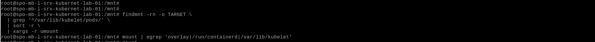

A verificação final confirmou que não permaneciam montagens temporárias associadas ao Kubernetes.

---

## Condições para início da migração

Ao término da etapa de parada do Kubernetes o ambiente encontrava-se em um estado seguro para a sincronização final dos dados.

Foram confirmadas as seguintes condições:

| Verificação | Situação |
| --- | --- |
| Nó bloqueado para novos agendamentos | ✔ |
| Réplicas registradas | ✔ |
| Deployments reduzidos | ✔ |
| StatefulSets reduzidos | ✔ |
| Pods encerrados | ✔ |
| kubelet interrompido | ✔ |
| Containers finalizados | ✔ |
| Sistemas de arquivos temporários desmontados | ✔ |

Com todas essas verificações concluídas, o sistema operacional encontrava-se completamente inativo do ponto de vista das cargas de trabalho do Kubernetes, permitindo iniciar a sincronização do ambiente para o novo conjunto de discos SSD com segurança e consistência.

---

## Preparação do novo ambiente para sincronização

Após a interrupção das cargas de trabalho do Kubernetes e a liberação dos pontos de montagem temporários, iniciou-se a preparação do novo ambiente para receber a cópia do sistema operacional.

O objetivo desta etapa foi montar os sistemas de arquivos do RAID SSD sob um diretório temporário, reproduzindo a mesma hierarquia de montagem utilizada pelo sistema original.

Essa organização foi necessária para que o `rsync` direcionasse os arquivos de cada diretório para o Logical Volume correspondente no novo armazenamento.

---

### Montagem da nova estrutura

O diretório `/mnt/root` foi utilizado como raiz temporária do sistema migrado.

Inicialmente, o novo Logical Volume destinado à raiz foi montado nesse diretório:

```bash
cd /mnt

mkdir -p root

mount /dev/mapper/dados-root root
```

Após a montagem da raiz, foram criados os diretórios necessários para receber os demais sistemas de arquivos:

```bash
mkdir -p \
    root/boot \
    root/home \
    root/usr \
    root/var \
    root/tmp
```

Na sequência, cada Logical Volume foi montado no ponto correspondente:

```bash
mount /dev/mapper/dados-home root/home
mount /dev/mapper/dados-usr  root/usr
mount /dev/mapper/dados-var  root/var
mount /dev/mapper/dados-tmp  root/tmp
```

Como os volumes destinados aos backups e aos dados do `containerd` estavam localizados abaixo de `/var`, seus pontos de montagem foram criados somente após a montagem do volume `dados-var`:

```bash
mkdir -p \
    root/var/Backup \
    root/var/lib/containerd

mount /dev/mapper/dados-backup root/var/Backup
mount /dev/mapper/dados-docker root/var/lib/containerd
```

Por fim, foram montadas as partições responsáveis pela inicialização do sistema:

```bash
mount /dev/sdb2 root/boot

mkdir -p root/boot/efi

mount /dev/sdb3 root/boot/efi
```

A ordem das montagens foi importante. Os volumes principais precisavam ser montados antes dos volumes localizados em seus subdiretórios. Caso contrário, uma montagem posterior poderia ocultar o conteúdo ou o ponto de montagem anteriormente preparado.

---

### Estrutura final de montagem

A estrutura preparada para receber a sincronização ficou organizada da seguinte forma:

| Dispositivo | Ponto de montagem temporário | Ponto de montagem após o boot |
| --- | --- | --- |
| `/dev/mapper/dados-root` | `/mnt/root` | `/` |
| `/dev/mapper/dados-home` | `/mnt/root/home` | `/home` |
| `/dev/mapper/dados-usr` | `/mnt/root/usr` | `/usr` |
| `/dev/mapper/dados-var` | `/mnt/root/var` | `/var` |
| `/dev/mapper/dados-tmp` | `/mnt/root/tmp` | `/tmp` |
| `/dev/mapper/dados-backup` | `/mnt/root/var/Backup` | `/var/Backup` |
| `/dev/mapper/dados-docker` | `/mnt/root/var/lib/containerd` | `/var/lib/containerd` |
| `/dev/sdb2` | `/mnt/root/boot` | `/boot` |
| `/dev/sdb3` | `/mnt/root/boot/efi` | `/boot/efi` |

A área de swap não precisava ser montada nessa etapa. Sua ativação seria realizada posteriormente pelo sistema operacional a partir da configuração do `/etc/fstab`.

---

### Validação das Montagens

Após a montagem de todos os volumes, foi utilizado o comando `lsblk -f` para validar:

- os sistemas de arquivos existentes;
- os UUIDs dos novos volumes;
- os respectivos pontos de montagem;
- a separação entre o RAID original e o novo RAID SSD;
- a correspondência entre a estrutura de origem e a estrutura de destino.

#### Evidência relacionada

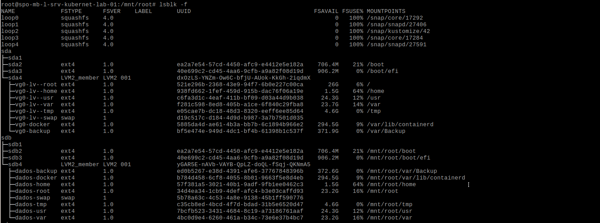

A saída demonstra a coexistência das duas estruturas de armazenamento.

O RAID original permanecia montado nos pontos utilizados pelo sistema em execução, enquanto os volumes do novo RAID SSD estavam montados abaixo de `/mnt/root`, prontos para receber a cópia.

Essa validação também reduziu o risco de inversão entre origem e destino antes da execução do `rsync`.

---

## Sincronização do sistema operacional

Com a nova estrutura completamente montada, iniciou-se a sincronização dos dados do sistema operacional.

A ferramenta escolhida foi o `rsync`, pois permitia realizar a cópia em nível de arquivos, preservando os metadados necessários ao funcionamento do sistema sem transferir blocos não utilizados.

Entre as características relevantes dessa abordagem estavam:

- cópia somente dos arquivos existentes;
- preservação de proprietários e grupos;
- preservação de permissões;
- preservação de links simbólicos;
- preservação de hard links;
- preservação de ACLs;
- preservação de atributos estendidos;
- manutenção dos identificadores numéricos de usuários e grupos;
- possibilidade de repetir a sincronização;
- registro detalhado da execução em arquivo de log.

---

### Execução em sessão persistente

A sincronização foi executada dentro de uma sessão do GNU Screen:

```bash
screen
```

A utilização de uma sessão persistente evitou que uma eventual perda da conexão SSH interrompesse a cópia.

Caso a sessão administrativa fosse desconectada, seria possível acessar novamente o servidor e retornar à execução com:

```bash
screen -r
```

Essa precaução foi necessária porque a transferência envolvia dezenas de gigabytes e poderia permanecer em execução por um período prolongado.

---

### Comando de sincronização

Dentro da sessão do GNU Screen, foi definido um arquivo de log com data e hora da execução:

```bash
cd /

LOG="/var/Backup/rsync-clone-$(date +%Y%m%d-%H%M%S).log"
```

Em seguida, foi iniciada a sincronização:

```bash
rsync -aHAXv \
    --numeric-ids \
    --info=progress2,stats2 \
    --delete \
    --exclude='/proc/*' \
    --exclude='/sys/*' \
    --exclude='/dev/*' \
    --exclude='/run/*' \
    --exclude='/tmp/*' \
    --exclude='/mnt/*' \
    --exclude='/media/*' \
    --exclude='/lost+found' \
    / /mnt/root/ \
    2>&1 | tee "$LOG"
```

A origem utilizada foi a raiz do sistema em execução:

```text
/
```

O destino foi a nova raiz temporária:

```text
/mnt/root/
```

Como os subvolumes do destino já estavam montados em seus respectivos diretórios, os arquivos de `/usr`, `/var`, `/home`, `/tmp`, `/var/Backup` e `/var/lib/containerd` foram gravados diretamente nos Logical Volumes correspondentes.

---

### Opções utilizadas no `rsync`

| Opção | Função |
| --- | --- |
| `-a` | Ativa o modo de arquivamento, preservando estrutura, permissões, datas, proprietários, grupos e links simbólicos |
| `-H` | Preserva hard links |
| `-A` | Preserva ACLs |
| `-X` | Preserva atributos estendidos |
| `-v` | Exibe informações detalhadas da operação |
| `--numeric-ids` | Preserva UID e GID numericamente, sem depender da resolução de nomes |
| `--info=progress2,stats2` | Exibe o progresso global e estatísticas detalhadas |
| `--delete` | Remove do destino arquivos que não existam na origem |
| `--exclude` | Impede a cópia de diretórios temporários ou gerenciados dinamicamente |
| `tee` | Exibe a saída na tela e, simultaneamente, grava o resultado em arquivo de log |

As opções `-r`, `-t`, `-l`, `-o` e `-g` não precisam ser informadas separadamente, pois já estão incluídas na opção `-a`.

---

### Exclusão dos pseudo-sistemas de arquivos

Os diretórios `/proc`, `/sys`, `/dev` e `/run` não foram copiados porque representam pseudo-sistemas de arquivos criados dinamicamente pelo kernel e pelos serviços durante a inicialização.

Também foram excluídos:

- `/tmp`, por conter dados temporários;
- `/mnt`, para impedir que o `rsync` entrasse no próprio destino e criasse uma cópia recursiva;
- `/media`, por representar pontos de montagem removíveis;
- `lost+found`, por ser criado automaticamente pelo sistema de arquivos.

Esses diretórios foram recriados ou preenchidos normalmente durante a inicialização do sistema pelo novo RAID.

---

### Verificação da sincronização

Ao término da operação, o arquivo de log foi consultado para validar as estatísticas da transferência:

```bash
tail -f /var/Backup/rsync-clone-20260728-141717.log
```

#### Evidência relacionada

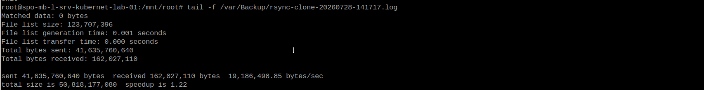

A saída do `rsync` registrou aproximadamente:

- **50,8 GB** de conteúdo lógico analisado;
- **41,6 GB** enviados durante a sincronização;
- aproximadamente **19,2 MB/s** de taxa média;
- relação de otimização (*speedup*) de **1,22**.

Essas informações confirmaram a conclusão da transferência e demonstraram uma das vantagens do `rsync`: somente os arquivos efetivamente existentes precisaram ser processados, sem a cópia integral dos aproximadamente 950 GB disponíveis no volume de origem.

Com a sincronização concluída, a nova estrutura passou a conter uma réplica funcional do sistema operacional, e ainda era necessário ajustar os identificadores dos sistemas de arquivos, reconstruir o `/etc/fstab` e preparar o carregador de inicialização.

---

## Preparação do novo sistema para inicialização

Após a conclusão da sincronização com `rsync`, o novo RAID SSD já continha os arquivos do sistema operacional. Entretanto, a simples cópia dos dados não tornou o ambiente automaticamente inicializável.

Ainda foi necessário preparar o sistema copiado para reconhecer sua nova estrutura de armazenamento e instalar o carregador de inicialização no novo disco.

Para isso, utilizou-se um ambiente `chroot`, permitindo executar comandos sobre o sistema localizado em `/mnt/root` como se ele já tivesse sido inicializado a partir do novo RAID SSD.

O `chroot` não participou da cópia dos dados. Sua função foi permitir a preparação do ambiente de boot do sistema migrado.

---

### Preparação do ambiente `chroot`

Antes de acessar o novo sistema, foram disponibilizados dentro de `/mnt/root` os pseudo-sistemas de arquivos necessários para o funcionamento das ferramentas de administração.

```bash
mount --bind /dev /mnt/root/dev
mount --bind /dev/pts /mnt/root/dev/pts
mount -t proc proc /mnt/root/proc
mount -t sysfs sys /mnt/root/sys
mount -t tmpfs tmpfs /mnt/root/run
```

Essas montagens disponibilizaram ao sistema migrado:

- os dispositivos presentes em `/dev`;
- os terminais pseudo-TTY em `/dev/pts`;
- as informações de processos em `/proc`;
- as informações de hardware e kernel em `/sys`;
- a estrutura temporária de execução em `/run`.

Após essa preparação, o novo sistema foi acessado com:

```bash
chroot /mnt/root /bin/bash
```

A partir desse momento, os comandos passaram a utilizar `/mnt/root` como diretório raiz, atuando diretamente sobre o sistema copiado para o novo RAID SSD.

#### Evidência relacionada

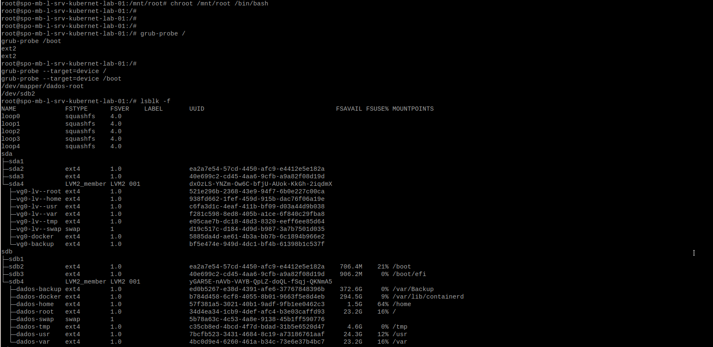

---

### Validação do sistema migrado

Antes da instalação do GRUB, foram realizadas verificações para confirmar que o ambiente copiado possuía os componentes necessários para inicializar de forma independente.

Foram validados:

- a presença dos arquivos do sistema operacional;
- o reconhecimento do Volume Group `dados`;
- a disponibilidade dos Logical Volumes;
- a montagem da partição `/boot`;
- a montagem da partição `/boot/efi`;
- a presença dos kernels instalados;
- a disponibilidade das ferramentas do GRUB;
- a configuração do arquivo `/etc/fstab`;
- a capacidade de regenerar o `initramfs`.

Essa etapa reduziu o risco de instalar o carregador de inicialização sobre uma estrutura incompleta ou apontando para dispositivos incorretos.

---

### Instalação do GRUB no novo RAID

A análise do servidor confirmou que o sistema utilizava inicialização em modo BIOS Legacy, com tabela de partições DOS/MBR.

Por esse motivo, o GRUB foi instalado utilizando a plataforma `i386-pc`, diretamente no disco correspondente ao novo Virtual Drive SSD:

```bash
grub-install \
    --target=i386-pc \
    --recheck \
    /dev/sdb
```

O destino utilizado foi `/dev/sdb`, que correspondia ao novo RAID SSD apresentado pela controladora ao sistema operacional.

A instalação foi realizada sobre o disco completo, e não sobre uma partição específica, porque no modo BIOS o código inicial do GRUB é gravado na área de inicialização do dispositivo.

#### Evidência relacionada

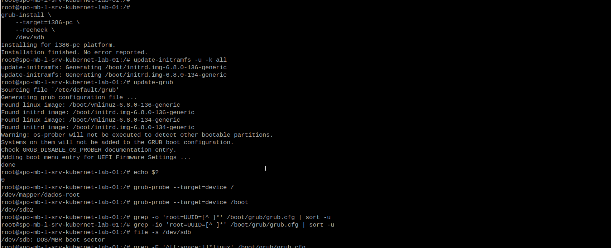

---

### Regeneração do `initramfs`

Após a instalação do GRUB, foram regeneradas as imagens de inicialização dos kernels instalados:

```bash
update-initramfs -u -k all
```

O `initramfs` contém os módulos, ferramentas e regras necessários para que o kernel consiga localizar e montar o sistema de arquivos raiz durante o processo de boot.

Essa etapa foi particularmente importante porque o sistema passou a inicializar utilizando:

- um novo Physical Volume;
- um novo Volume Group denominado `dados`;
- novos Logical Volumes;
- novos UUIDs para os sistemas de arquivos.

A regeneração garantiu que as imagens de inicialização fossem atualizadas com as informações do novo ambiente.

---

### Atualização da configuração do GRUB

Na sequência, foi regenerado o arquivo de configuração do GRUB:

```bash
update-grub
```

O comando identificou os kernels presentes em `/boot` e atualizou o arquivo:

```text
/boot/grub/grub.cfg
```

Durante essa etapa foram detectadas as versões de kernel instaladas no servidor, incluindo:

```text
6.8.0-136
6.8.0-134
```

Também foi verificado que a entrada de inicialização apontava para o novo volume raiz:

```text
/dev/mapper/dados-root
```

Essa conferência confirmou que o carregador de inicialização estava sendo configurado para utilizar a estrutura LVM criada no novo RAID SSD.

---

### Validação do tipo de inicialização

Como validação adicional, foi verificada a estrutura de inicialização do novo disco:

```bash
file -s /dev/sdb
```

A saída confirmou a presença de uma tabela de partições DOS/MBR, compatível com a instalação do GRUB em modo BIOS utilizando o alvo `i386-pc`.

Essa validação foi importante para confirmar a coerência entre:

- o modo de inicialização utilizado pelo servidor;
- a tabela de partições do novo disco;
- o destino da instalação do GRUB;
- a plataforma selecionada no `grub-install`.

---

### Resultado da preparação do boot

Ao término dessa etapa, o novo RAID SSD possuía:

- uma cópia completa do sistema operacional;
- a estrutura LVM baseada no Volume Group `dados`;
- os sistemas de arquivos configurados;
- as partições de boot montadas;
- o GRUB instalado em `/dev/sdb`;
- as imagens de `initramfs` regeneradas;
- o arquivo `grub.cfg` atualizado;
- entradas de boot apontando para `/dev/mapper/dados-root`.

Com essas validações concluídas, o novo ambiente estava preparado para realizar o primeiro boot de forma independente do RAID mecânico original.

---

### Encadeamento da etapa

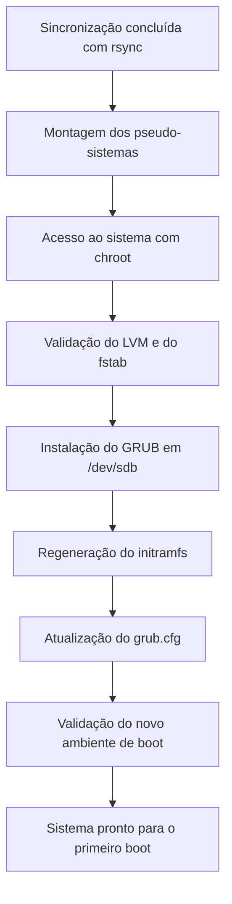
```mermaid
flowchart TD
    A[Sincronização concluída com rsync] --> B[Montagem dos pseudo-sistemas]
    B --> C[Acesso ao sistema com chroot]
    C --> D[Validação do LVM e do fstab]
    D --> E[Instalação do GRUB em /dev/sdb]
    E --> F[Regeneração do initramfs]
    F --> G[Atualização do grub.cfg]
    G --> H[Validação do novo ambiente de boot]
    H --> I[Sistema pronto para o primeiro boot]
```

O uso do `chroot` permitiu transformar a cópia realizada pelo `rsync` em um sistema inicializável. A migração dos dados já havia sido concluída; nessa etapa foram reconstruídos os elementos necessários para que o servidor pudesse iniciar diretamente pelo novo conjunto de discos SSD.

---

## Ativação do novo RAID SSD

Após a preparação do sistema operacional, a instalação do GRUB e a regeneração do `initramfs`, restava definir qual Virtual Drive seria apresentado pela controladora como dispositivo de inicialização.

Essa alteração foi mantida para o final do procedimento. Até esse momento, o RAID mecânico original continuava definido como volume de boot, preservando uma possibilidade imediata de retorno caso alguma validação do novo ambiente apresentasse falha.

---

### Validação dos Virtual Drives

Antes da alteração da ordem de inicialização, foi realizada uma nova consulta à controladora IBM ServeRAID M1015 utilizando o MegaCLI:

```bash
/opt/MegaRAID/MegaCli/MegaCli64 -LDInfo -Lall -aAll
```

A consulta confirmou a existência de dois Virtual Drives configurados em RAID1 e em estado `Optimal`:

| Virtual Drive | Capacidade | Finalidade |
| --- | ---: | --- |
| VD0 — Target ID 0 | 930,390 GB | Sistema original em discos mecânicos |
| VD1 — Target ID 1 | 952,742 GB | Novo sistema em discos SSD |

A coexistência dos dois volumes permitiu realizar toda a preparação do novo sistema sem modificar o RAID utilizado pelo ambiente em produção.

#### Evidência relacionada


A saída confirma que os dois Virtual Drives estavam íntegros e disponíveis antes da alteração do dispositivo de inicialização.

---

### Alteração do Virtual Drive de boot

**Observação técnica**
>
> A alteração do Virtual Drive de inicialização pôde ser realizada diretamente pelo sistema operacional porque o servidor utilizava uma controladora **IBM ServeRAID M1015**, cuja configuração é acessível por meio do utilitário **MegaCLI**.
>
> Em servidores cuja controladora não oferece esse tipo de gerenciamento em ambiente operacional, ou quando são utilizados controladores SATA/AHCI sem gerenciamento dedicado, a alteração do dispositivo de inicialização deve ser realizada manualmente na configuração de firmware do equipamento (BIOS/UEFI), selecionando o novo disco como primeiro dispositivo de boot.
>
> Portanto, esta etapa é específica para equipamentos que suportam gerenciamento da controladora RAID por software e pode variar conforme o fabricante e o modelo do hardware.

Com o novo sistema completamente preparado, o Virtual Drive 1 foi definido como volume de inicialização da controladora.

O comando utilizado foi:

```bash
/opt/MegaRAID/MegaCli/MegaCli64 -AdpBootDrive -Set -L1 -a0
```

Os parâmetros indicam:

| Parâmetro | Função |
| --- | --- |
| `-AdpBootDrive` | Gerencia o Virtual Drive utilizado para boot |
| `-Set` | Define um novo volume de inicialização |
| `-L1` | Seleciona o Virtual Drive 1 |
| `-a0` | Aplica a configuração ao adaptador 0 |

A controladora confirmou a alteração:

```text
Boot Virtual Drive is set to #1 (target id #1) on Adapter 0

Exit Code: 0x00
```

O código de saída `0x00` indicou que o comando foi executado com sucesso.

#### Evidência relacionada

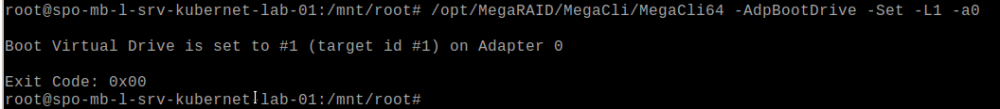

Essa operação alterou apenas o Virtual Drive selecionado pela controladora para inicialização. O RAID mecânico original permaneceu íntegro e disponível, sem qualquer modificação em seus dados.

---

### Confirmação da configuração de boot

Após a alteração, foi realizada uma nova consulta para confirmar que a configuração havia sido efetivamente registrada:

```bash
/opt/MegaRAID/MegaCli/MegaCli64 -AdpBootDrive -Get -a0
```

A controladora retornou:

```text
Adapter 0: Boot Virtual Drive - #1 (target id - 1).

Exit Code: 0x00
```

O resultado confirmou que o Virtual Drive 1, correspondente ao novo RAID SSD, estava selecionado como dispositivo de inicialização.

Essa validação foi realizada antes da reinicialização para evitar depender apenas da resposta do comando de alteração.

---

### Persistência das gravações pendentes

Antes da reinicialização foi executado o comando:

```bash
sync
```

O `sync` solicita ao kernel a gravação dos dados pendentes mantidos em cache para os dispositivos de armazenamento.

Essa etapa foi especialmente importante porque, durante o procedimento, haviam sido realizados:

- sincronização de arquivos com `rsync`;
- alterações no `/etc/fstab`;
- instalação do GRUB;
- regeneração do `initramfs`;
- atualização do arquivo `grub.cfg`;
- alterações na configuração de boot da controladora.

A execução do `sync` reduziu o risco de reinicializar o servidor com dados ainda mantidos apenas nos buffers de escrita do sistema operacional.

---

### Reinicialização forçada

Após a confirmação da ordem de boot e a sincronização dos buffers, o servidor foi reinicializado utilizando o mecanismo Magic SysRq:

```bash
echo b > /proc/sysrq-trigger
```

O comando `b` provoca uma reinicialização imediata do kernel, sem executar o processo convencional de desligamento dos serviços e sem desmontar novamente os sistemas de arquivos.

Essa forma de reinicialização foi utilizada porque as cargas do Kubernetes já haviam sido encerradas, o `kubelet` estava parado, os containers remanescentes haviam sido finalizados, os pontos de montagem temporários haviam sido liberados e o comando `sync` havia sido executado previamente.

Ainda assim, trata-se de uma reinicialização forçada. Ela não deve ser apresentada como equivalente a um `reboot` convencional, pois ignora as rotinas normais de encerramento do sistema.

#### Evidência relacionada

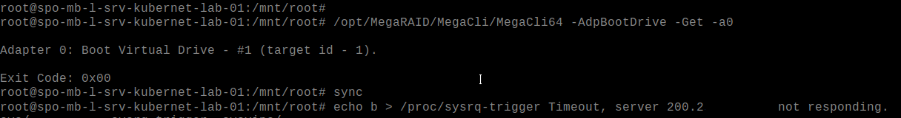

A captura registra a confirmação do Virtual Drive 1 como dispositivo de boot, a execução do `sync` e o acionamento da reinicialização imediata.

---

### Momento de transição

A reinicialização marcou a troca efetiva entre os dois ambientes:

```text
Antes da reinicialização
└── Boot pela controladora
    └── Virtual Drive 0
        └── RAID1 com discos mecânicos
            └── VG vg0

Após a reinicialização
└── Boot pela controladora
    └── Virtual Drive 1
        └── RAID1 com discos SSD
            └── VG dados
```

Embora todas as verificações anteriores reduzissem significativamente o risco, o primeiro boot pelo novo RAID representava o ponto decisivo da migração.

Até esse momento haviam sido validados:

- o estado do novo RAID1;
- a tabela de partições;
- a estrutura LVM;
- os sistemas de arquivos;
- a sincronização dos dados;
- o arquivo `/etc/fstab`;
- a instalação do GRUB em `/dev/sdb`;
- a regeneração do `initramfs`;
- a geração do `grub.cfg`;
- a seleção do Virtual Drive 1 como volume de boot.

A conclusão técnica da migração, entretanto, ainda dependia da validação do sistema após a inicialização e da recuperação operacional do Kubernetes.

---
## Primeiro boot e recuperação do Kubernetes

A primeira inicialização pelo novo RAID SSD representou a validação prática de todo o procedimento de migração.

O servidor iniciou normalmente, sem entrar em modo de emergência, utilizando o sistema operacional armazenado no novo conjunto de discos e a estrutura LVM criada no Volume Group `dados`.

Antes da recuperação das aplicações, foram confirmados:

- carregamento do sistema pelo novo RAID SSD;
- utilização de `/dev/mapper/dados-root` como sistema de arquivos raiz;
- ativação do Volume Group `dados`;
- montagem dos volumes definidos no `/etc/fstab`;
- inicialização do `containerd`;
- inicialização do `kubelet`;
- disponibilidade do plano de controle do Kubernetes;
- acesso funcional ao cluster por meio do `kubectl` e do K9s.

O Volume Group original, `vg0`, continuava visível porque o RAID mecânico permanecia conectado ao servidor. Entretanto, o sistema já estava executando sobre o novo Volume Group `dados`, conforme planejado.

Após o boot pelo novo RAID SSD, o Kubernetes precisou ser liberado e validado.

### Sequência recomendada

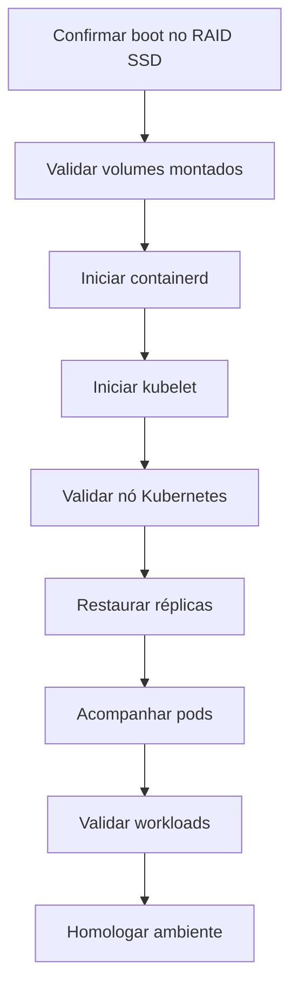
```mermaid
flowchart TD
    A[Confirmar boot no RAID SSD] --> B[Validar volumes montados]
    B --> C[Iniciar containerd]
    C --> D[Iniciar kubelet]
    D --> E[Validar nó Kubernetes]
    E --> F[Restaurar réplicas]
    F --> G[Acompanhar pods]
    G --> H[Validar workloads]
    H --> I[Homologar ambiente]
```

---

### Validação inicial do cluster

Após o boot, o K9s conseguiu se conectar normalmente ao contexto administrativo do cluster:

```text
kubernetes-admin@kubernetes
```

Também foram identificados os namespaces existentes:

```text
default
kube-flannel
kube-node-lease
kube-public
kube-system
local-path-storage
novu
traefik
```

Essa verificação confirmou que:

- o `etcd` carregou corretamente a base de dados do cluster;
- o `kube-apiserver` estava acessível;
- o estado dos objetos Kubernetes havia sido preservado;
- os namespaces e recursos anteriormente existentes continuavam registrados.

#### Evidência relacionada

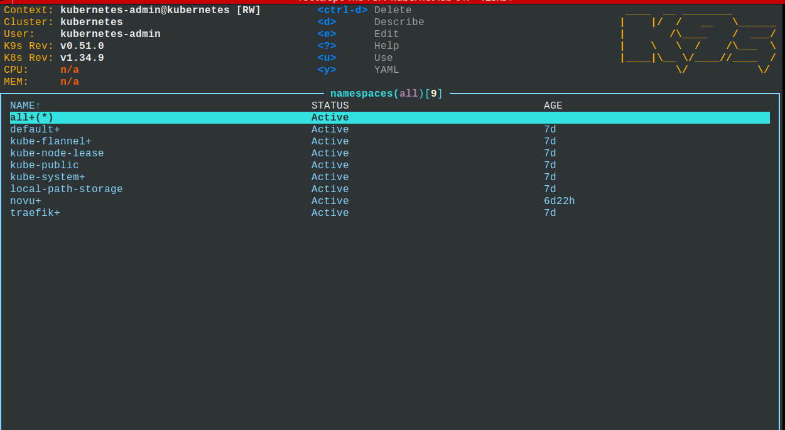

A imagem demonstra o acesso ao cluster após a inicialização pelo novo RAID SSD e a preservação dos namespaces existentes.

---

### Restauração das réplicas

Antes da parada do ambiente, a quantidade de réplicas dos Deployments e StatefulSets havia sido registrada no arquivo:

```text
/root/kubernetes-replicas-before-backup.txt
```

Esse arquivo foi utilizado como referência para restaurar as cargas de trabalho à configuração existente antes da migração.

A restauração foi realizada interpretando os registros salvos e aplicando novamente a quantidade de réplicas de cada recurso:

```bash
awk '
NR==1 {next}

$2=="Deployment" {
    printf(
        "kubectl scale deployment %s -n %s --replicas=%s\n",
        $3, $1, $4
    )
}

$2=="StatefulSet" {
    printf(
        "kubectl scale statefulset %s -n %s --replicas=%s\n",
        $3, $1, $4
    )
}
' /root/kubernetes-replicas-before-backup.txt | bash
```

Após a execução, a recuperação dos Pods foi acompanhada com:

```bash
watch -n 2 'kubectl get pods -A'
```

O arquivo de réplicas foi mantido após a migração como registro do estado anterior do cluster e como evidência para eventual auditoria ou necessidade de recuperação.

---

### Pods permanecendo em `Pending`

Durante a recuperação, vários StatefulSets foram recriados, porém seus Pods permaneceram com estado `Pending`.

Entre os recursos afetados estavam:

```text
alertmanager-prometheus-kube-prometheus-alertmanager-0
kafka-0
loki-0
loki-chunks-cache-0
loki-results-cache-0
mongo-0
mysql-0
postgres-0
prometheus-prometheus-kube-prometheus-prometheus-0
```

O plano de controle estava operacional e os componentes essenciais do cluster encontravam-se em execução:

```text
etcd
kube-apiserver
kube-controller-manager
kube-scheduler
kube-proxy
kube-flannel
```

Portanto, o estado `Pending` não estava relacionado a uma falha no boot, no `etcd`, no runtime de containers ou nos volumes migrados.

A verificação do nó apresentou o seguinte estado:

```text
Ready,SchedulingDisabled
```

O nó permanecia bloqueado para novos agendamentos porque o comando `kubectl cordon` havia sido executado antes da migração e essa condição foi preservada no estado do cluster armazenado pelo `etcd`.

---

### Liberação do nó para agendamento

Como o cluster possuía apenas um nó, enquanto ele permanecesse em `SchedulingDisabled` o scheduler não teria outro destino disponível para os novos Pods.

O agendamento foi liberado com:

```bash
kubectl uncordon spo-mb-l-srv-kubernet-lab-01
```

Em seguida, o estado do nó foi novamente verificado:

```bash
kubectl get nodes
```

O estado esperado passou a ser:

```text
Ready
```

Sem a indicação `SchedulingDisabled`.

Após essa alteração, os Pods que estavam em `Pending` começaram a ser agendados e inicializados normalmente.

Esse comportamento confirmou que o atraso na recuperação não estava relacionado à migração do armazenamento, mas ao estado administrativo aplicado ao nó antes da janela de manutenção.

---

### Validação dos workloads

Após a liberação do agendamento, foi acompanhado o retorno dos componentes do cluster e das aplicações.

Foram validados em execução:

- `etcd`;
- `kube-apiserver`;
- `kube-controller-manager`;
- `kube-scheduler`;
- `kube-proxy`;
- Flannel;
- Local Path Provisioner;
- Alertmanager;
- Kafka;
- Loki e seus componentes de cache;
- MongoDB;
- MySQL;
- PostgreSQL;
- Prometheus;
- Node Exporter.

A visualização final no K9s apresentou os Pods em estado `Running` e com seus containers prontos.

#### Evidência relacionada

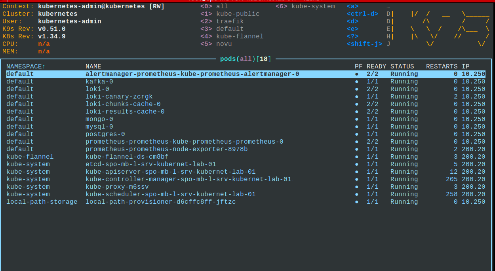

A imagem confirma o retorno dos componentes do plano de controle, do provisionador de armazenamento e das principais cargas de trabalho após a liberação do nó para agendamento.

---

### Verificações finais

Ao término da recuperação foram executadas verificações sobre os principais recursos do cluster:

```bash
kubectl get nodes
kubectl get deployments -A
kubectl get statefulsets -A
kubectl get pods -A
kubectl get pvc -A
```

Também poderia ser utilizada a consulta de eventos recentes para identificar falhas ocorridas durante a inicialização:

```bash
kubectl get events -A \
    --sort-by=.lastTimestamp
```

As validações confirmaram:

| Verificação | Resultado |
| --- | --- |
| Boot pelo novo RAID SSD | Concluído |
| Sistema raiz em `/dev/mapper/dados-root` | Confirmado |
| Volume Group `dados` ativo | Confirmado |
| `containerd` operacional | Confirmado |
| `kubelet` operacional | Confirmado |
| Plano de controle disponível | Confirmado |
| Estado do cluster preservado no `etcd` | Confirmado |
| Réplicas restauradas | Concluído |
| Nó liberado para agendamento | Concluído |
| Pods recriados | Concluído |
| StatefulSets recuperados | Concluído |
| Workloads em execução | Confirmado |

---

### Conclusão da migração

A migração foi considerada concluída após a confirmação de que o servidor havia inicializado pelo novo RAID SSD e de que o cluster Kubernetes retornara ao estado operacional.

O problema encontrado durante a recuperação — Pods permanecendo em `Pending` — ocorreu porque o nó ainda estava marcado como `SchedulingDisabled`, condição aplicada deliberadamente antes da migração.

A execução do `kubectl uncordon` restabeleceu o agendamento e permitiu que todas as cargas fossem recuperadas.

O resultado final confirmou:

- integridade do sistema operacional migrado;
- funcionamento do GRUB e do `initramfs`;
- ativação correta da nova estrutura LVM;
- preservação da base do `etcd`;
- recuperação dos objetos Kubernetes;
- disponibilidade dos volumes persistentes;
- retorno das aplicações e componentes de monitoramento.

Com todos os Pods necessários em estado `Running`, o ambiente foi homologado e a janela de manutenção encerrada.

---

## Complemento técnico 

### Engenharia da decisão

A migração não foi conduzida como uma simples sequência de comandos. Durante toda a execução foram avaliados riscos, alternativas e impactos operacionais.

Inicialmente foi considerada a clonagem integral utilizando `dd`. Após análise concluiu-se que essa estratégia seria adequada apenas para as pequenas partições de boot, tornando-se pouco eficiente para o volume principal devido ao tempo de cópia, replicação de blocos vazios e impossibilidade de reorganizar a estrutura LVM.

Optou-se então por reconstruir a estrutura LVM no novo RAID SSD e utilizar `rsync` para sincronização dos dados.

### Justificativa para um novo Volume Group

Criou-se um novo Volume Group denominado `dados` em vez de reutilizar `vg0`. Essa decisão eliminou ambiguidades enquanto os dois sistemas coexistiam no mesmo servidor e reduziu riscos durante o `grub-install`, geração do initramfs e validações do LVM.

### Parada controlada do Kubernetes

O objetivo principal foi impedir escritas durante o sincronismo. Para isso foi adotada uma sequência lógica: inventário dos workloads, salvamento das réplicas, cordon do nó, redução de Deployments e StatefulSets para zero, acompanhamento do encerramento dos Pods, parada do kubelet, verificação das Tasks do containerd e encerramento manual dos processos remanescentes.

### Encerramento de containers

Foi observado que a parada do kubelet não encerrou imediatamente todos os containers. Alguns processos permaneceram ativos no containerd e precisaram ser finalizados manualmente antes da desmontagem dos mounts temporários.

### Execução do rsync

A sincronização foi realizada dentro de uma sessão `screen`, preservando ACLs, atributos estendidos, hard links, permissões e identificadores numéricos. Pseudo-sistemas de arquivos foram excluídos da cópia por serem recriados durante o boot.

### Validação via chroot

Após a sincronização foi realizado `chroot` para validar a estrutura migrada, confirmar o reconhecimento do novo VG, regenerar o initramfs e instalar o GRUB no novo disco.

### Alteração do Virtual Drive

A troca do Virtual Drive de boot na controladora IBM ServeRAID foi deliberadamente deixada para o final. Até esse momento o RAID original permaneceu preservado, constituindo um mecanismo simples de rollback caso qualquer validação apresentasse falha.
