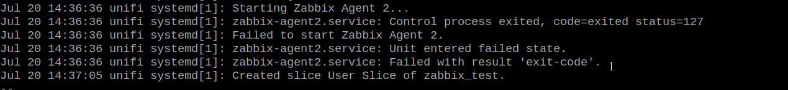
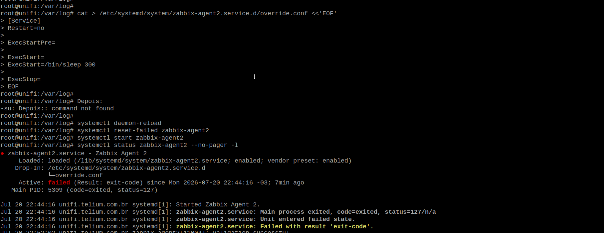
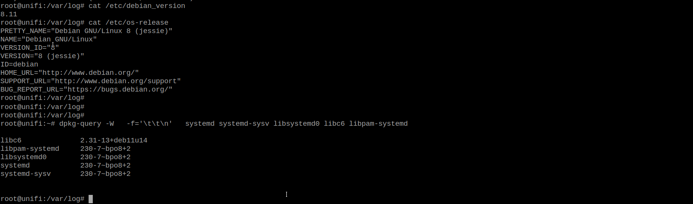
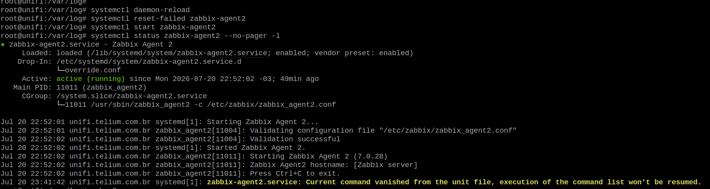
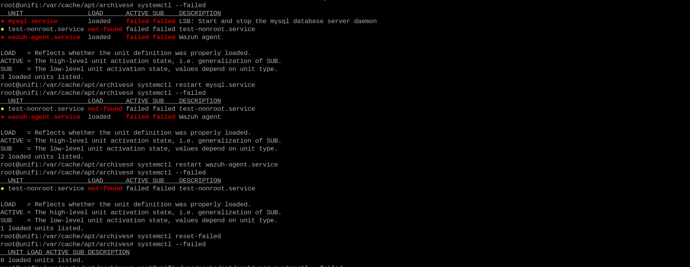

# Diagnóstico de serviços systemd retornando status=127 após instalação do Zabbix Agent 2

| Informação | Valor |
|------------|-------|
| Tipo | Estudo de Caso |
| Categoria | Linux / systemd |
| Nível | Avançado |
| Ambiente | Debian |
| Data | 2025-05-23 |

---

## Objetivo

Documentar a investigação realizada após a instalação do **Zabbix Agent 2**, onde o serviço não iniciava e retornava **status=127**.

Embora o problema tenha sido inicialmente associado ao Zabbix, a investigação demonstrou que a causa estava em uma inconsistência do sistema operacional, decorrente de uma atualização parcial do Debian.

Este estudo apresenta o processo de diagnóstico, as hipóteses levantadas, os testes realizados, as evidências coletadas e a solução aplicada.

---

## Ambiente


| Item | Valor |
|------|-------|
| Sistema Operacional | Debian Jessie |
| Kernel | 3.16 |
| systemd | 230 |
| libc | 2.31 |
| Serviço instalado | Zabbix Agent 2 |
| Outros serviços | MySQL, Wazuh Agent |

---

## Cenário

Após a instalação do **Zabbix Agent 2**, o serviço não iniciava.

A execução do comando:

```bash
systemctl status zabbix-agent2
```

retornava:

```text
Main process exited, code=exited, status=127
```

Inicialmente, tudo indicava um problema relacionado à instalação ou configuração do agente.

---

> **PRINT 01**

Status inicial do serviço apresentando erro **status=127**.




---

## Primeiras hipóteses

Como o erro ocorreu imediatamente após a instalação do agente, as primeiras linhas de investigação concentraram-se no próprio Zabbix.

Foram consideradas as seguintes possibilidades:

- erro na instalação do pacote;
- configuração incorreta;
- permissões do usuário `zabbix`;
- arquivo de configuração inválido;
- bibliotecas ausentes;
- problemas no PATH;
- falha nas variáveis de ambiente.

---

## Validação da configuração

O primeiro passo foi validar a configuração do agente.

```bash
sudo -u zabbix \
/usr/sbin/zabbix_agent2 \
-T \
-c /etc/zabbix/zabbix_agent2.conf
```

Resultado:

```text
Validation successful
```

Conclusão:

A configuração do agente estava correta.

---

## Ampliando a investigação

Como a configuração estava válida, passou-se a verificar se o problema era realmente do Zabbix.

Para isso, o serviço foi alterado temporariamente para executar apenas:

```ini
ExecStart=/bin/sleep 300
```

O resultado foi surpreendente.

Mesmo sem executar o Zabbix, o serviço continuava encerrando com:

```text
status=127
```

Esse teste foi o primeiro indício de que o problema não estava relacionado ao agente.

---

> **PRINT 02**

Teste substituindo o serviço por `/bin/sleep`.


---

!!! tip "Ponto de inflexão da investigação"

    A substituição do Zabbix por um simples `/bin/sleep` demonstrou que qualquer processo iniciado pelo **systemd** utilizando um usuário não privilegiado falhava com `status=127`.

    A partir desse momento a investigação deixou de focar no Zabbix e passou a analisar o sistema operacional.

---

## Confirmando a hipótese

Para eliminar definitivamente qualquer influência do agente, foi criado um novo serviço de teste utilizando o usuário `nobody`.

```ini
[Service]
User=nobody
Group=nogroup
ExecStart=/bin/sleep 300
```

O comportamento foi exatamente o mesmo.

```text
status=127
```

Conclusão:

O problema afetava qualquer serviço iniciado pelo **systemd** utilizando usuários não privilegiados.

---

## Hipóteses descartadas

Durante a investigação foram descartadas:

- configuração do Zabbix;
- permissões do usuário;
- grupos;
- PATH;
- LD_PRELOAD;
- LD_LIBRARY_PATH;
- AppArmor;
- Audit;
- shell;
- executável;
- arquivo de configuração.

---

## Descobrindo a causa

Com o foco deslocado para o sistema operacional, foi realizado um levantamento completo do ambiente.

Foi identificado que o servidor encontrava-se em um estado inconsistente, resultado de uma atualização parcial do Debian.

Resumo das versões encontradas:

| Componente | Versão |
|------------|---------|
| Debian | Jessie |
| Kernel | 3.16 |
| systemd | 230 |
| libc | 2.31 |

Além disso, centenas de pacotes permaneciam pendentes de atualização, caracterizando um ambiente híbrido entre versões do Debian.

---


Isso é reforçado pelo ```apt-cache policy```:

```
libc6:
  Installed: 2.31-13+deb11u14
  Candidate: 2.31-13+deb11u14

     2.31-13+deb11u14
        https://security.debian.org/debian-security/ bullseye-security/main
```

---

## Correção aplicada

Como o problema estava relacionado ao ambiente e não ao Zabbix, foi realizada uma atualização dos componentes responsáveis pelo gerenciamento de serviços.

```bash
apt install \
systemd \
systemd-sysv \
udev \
libpam-systemd
```

Após a atualização foi executado:

```bash
systemctl daemon-reload
```

Em seguida, os serviços foram reiniciados.

---

## Validação

Após a atualização:



O Zabbix Agent 2 iniciou sem qualquer alteração adicional em sua configuração.

---


Outros serviços que apresentaram problemas, foram iniciados com sucesso.

---

## Conclusão

Embora a falha tenha sido identificada durante a instalação do **Zabbix Agent 2**, o agente não era a causa do problema.

A investigação demonstrou que o erro estava relacionado ao próprio sistema operacional, que apresentava uma atualização parcial do Debian e uma inconsistência nos componentes do **systemd**.

A atualização desses componentes restaurou o funcionamento normal dos serviços executados por usuários não privilegiados.


